# Gehäuse am KitchenAid Artisan 5KMT2204

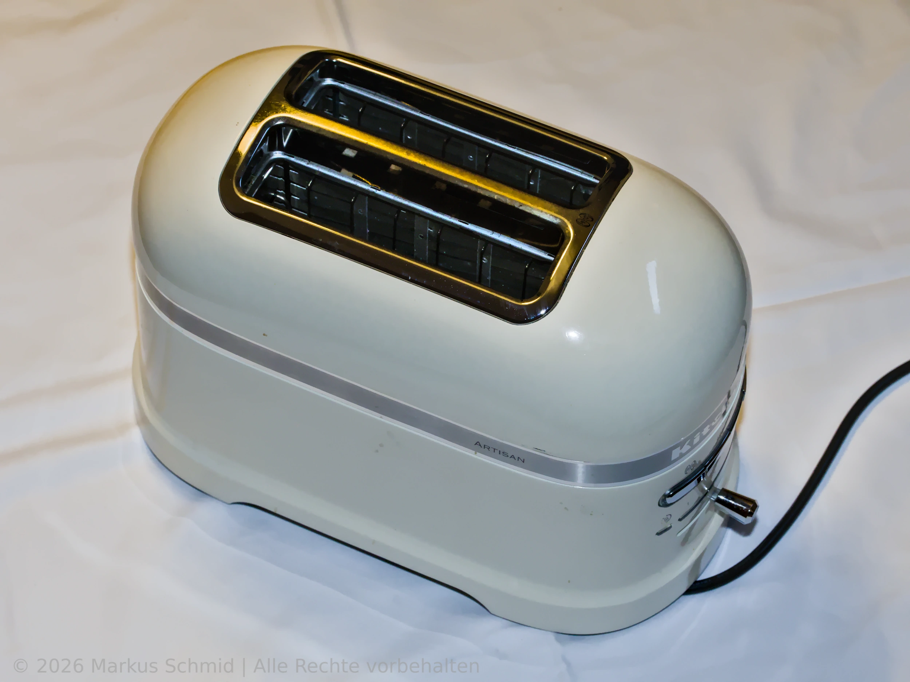

Anleitung zum Abmontieren des Gehäuses am KitchenAid Artisan Toaster (Modell 5KMT2204).

## Gründe fürs Abmontieren
* Reinigen und aussaugen
* Prüfen und reinigen der Infrarot-Lichtschranke
* Untersuchen und reinigen von Platinen
* Prüfen von mechanischen Blockaden oder Schwergängigkeit
* Messen der Stromversorgung
* Prüfen der Elektronik und Fehlerdiagnose

## Werkzeuge und Hilfsmittel
* **Spanner-Bit oder Schraubendreher (Größe SP 6):** Zum Lösen der Gehäuseschrauben:

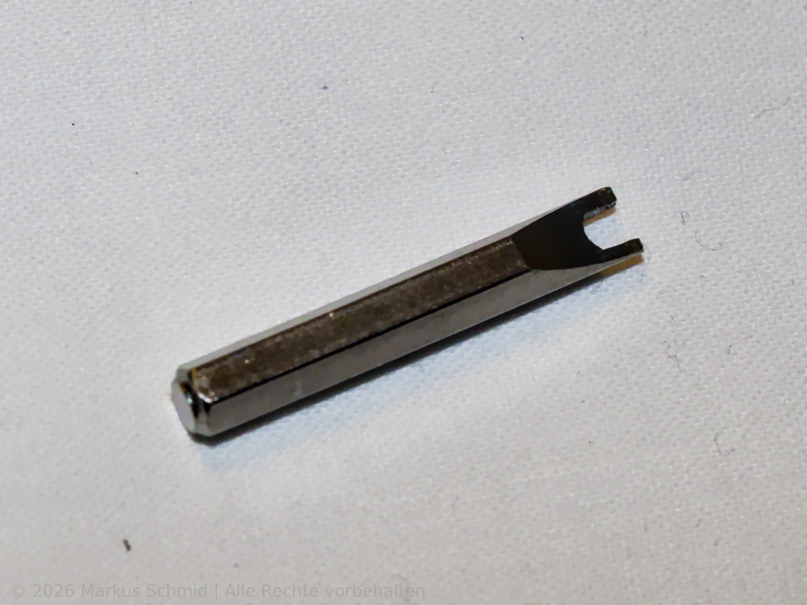

  *   **⚠️** Weil die Schrauben teils tief in engen Zugängen liegen, muss das Werkzeug mindestens 20 mm lang sein und darf maximal 6 mm breit sein:

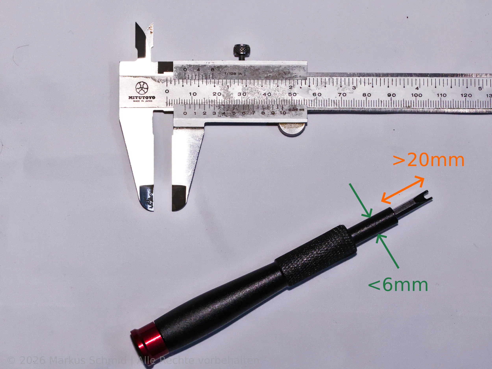

* **Kleine Flachzange:** Zum Abziehen der Platinenstecker (Sockelverbindung) oder Aufbiegen der Steckerverbindung vom Massekabel
* **Unterlage:** Weiche, helle und saubere Unterlage für die Arbeitsfläche (z. B. ein altes Bettlaken)
* **Reinigung:** Staubsauger mit Staubürstenaufsatz, Druckluftspray
* **Zubehör:** Kleiner Pinsel oder kleine weiche Bürste, Pinzette zum Entfernen von Sachen
* **Handy:** Taschenlampenfunktion fürs Ausleuchten

Für Fehlersuche und reinigen der Elektrik und Elektronik:

* **Kleiner Kreuzschraubenzieher:** Zum Abschrauben der Platine(n)
* **Pflege:** Isopropanol (Reinigungsalkohol) und Wattestäbchen
* **Messinstrumente:** Handy Cam-Handy (IR-Check), Multimeter,  Oszilloskop, Logikanalyzer (je nach Fehlerbild)

## Arbeitsplatz
* **Untergrund:** Eine saubere, ebene Fläche
* **Licht:** Eine gute Ausleuchtung
* **Ablagen:** Ablage oder kleiner Magnet für Schrauben

## Schritt für Schritt

### Schritt 1: Vorbereitung

> **⚠️** Netzstecker aus der Steckdose ziehen.

> **⚠️** Vor dem Umdrehen des Toasters die Krümelschublade herausziehen und sauber machen.

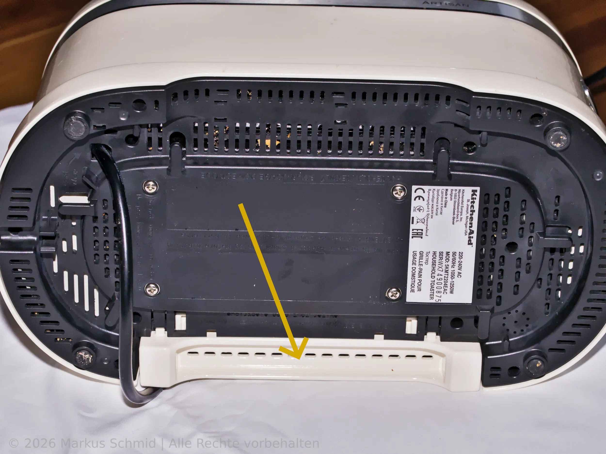

Das Gerät auf den Kopf drehen oder auf die Seite auf die Unterlage legen.

### Schritt 2: Gehäuseschrauben lösen

Lösen der sechs markierten Schrauben mit dem SP6-Schraubenzieher und beiseite legen. Die Schrauben sind alle gleich lang.

> **⚠️** Nur die markierten sechs Schrauben lösen. Lösen anderer Schrauben kann Teile im Inneren lockern, die dann ohne Bauplan und weitere Demontage nicht mehr montiert werden können.

> **⚠️** Falls die Schrauben am magnetischen Schraubenzieher haften, diesen vorsichtig herausziehen, damit die Schrauben nicht ins Innere des Toasters fallen und womöglich irgendwo unauffindbar eingeklemmt werden.

> **⚠️** Falls nicht alle 6 Schrauben herausgezogen wurden, nochmals prüfen, ob sie wirklich ganz locker sind und dann den Toaster einmal umdrehen und kräftig schütteln. Es sollen keine Schrauben ins Innere des Toasters fallen.

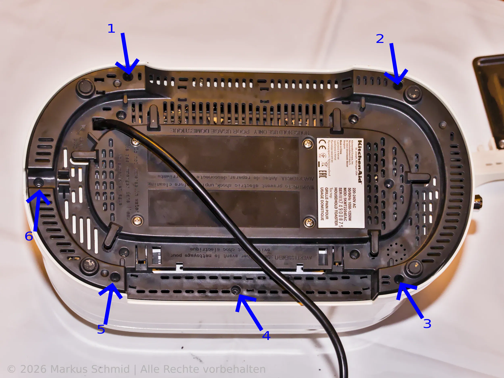

### Schritt 3: Abnehmen der Gehäuseschale

Vorsichtig das Metallgehäuse vom Chassis hochziehen, bis das Flachbandkabel von der Gehäuseschalterleiste und der Platinenstecker, der in der Steuerplatine im Toaster steckt, zum Voorschein kommen. 

Den Platinenstecker des Flachbandkabels vorsichtig von der Steuerplatine abziehen. Den Stecker ohne starkes Abwinkeln senkrecht nach oben von der Platine abziehen. Eventuell abwechselnd von beiden Seiten mit einem kleinen Schraubenzieher oder einer Flachzange in kleinen Schritten heraushebeln.

> **⚠️** Das Gehäuse kann nicht ganz entfernt werden, solange der Platinenstecker drin steckt.

Das Foto zeigt den hier wieder eingesteckten Platinenstecker nachdem das Gehäuses ganz entfernt wurde:

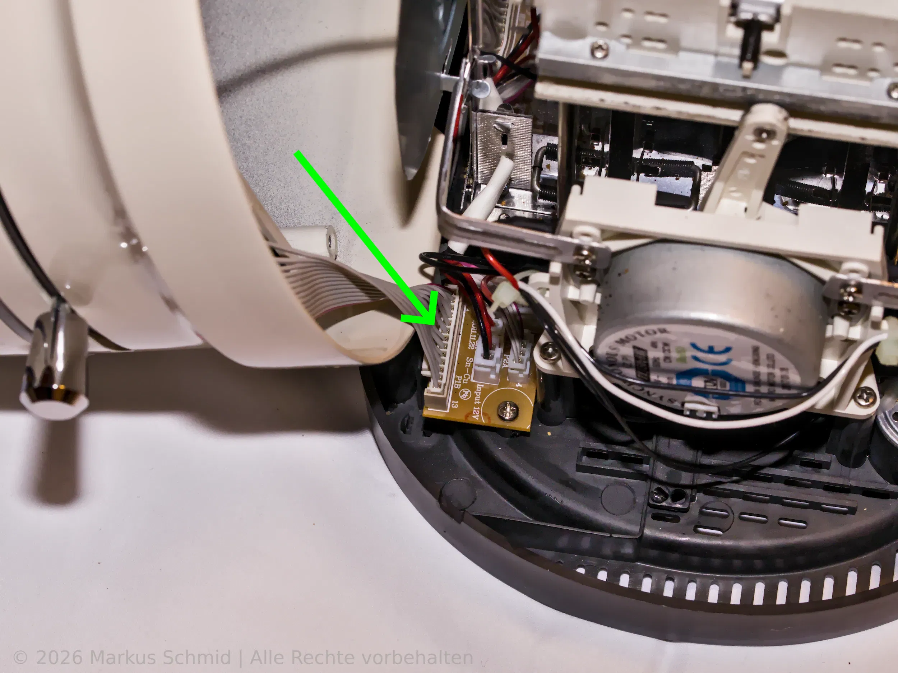

Da es eng zugeht, muss die richtige Position zwischen Gehäuse und Chassis gefunden werden, damit man das Gehäuse ganz anheben kann.

> **⚠️** Das Gehäuse kann nicht ganz entfernt werden, solange das Massekabel angesteckt ist.

Das Gehäuse so weit anheben, bis das gelbe Massekabel, das das Gehäuse mit Chassis verbindet, zu sehen ist. Die Klemme am Kabel etwas aufbiegen und abziehen. Danach kann man das Gehäuse vorsichtig ganz abheben.

Das Foto zeigt das Massekabel an der Verbindung zum Chassis: 

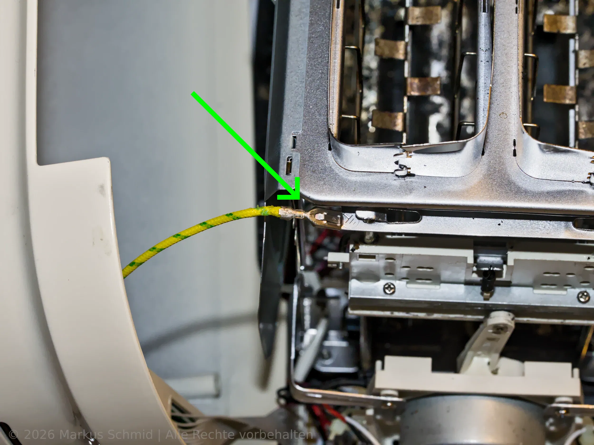

**Beispiele für Arbeiten am offenen Toaster:**

#### 1. Aussaugen
Entfernen von Krümeln, Brotstücken und Staub mit der Staubsaugerbürste.

#### 2. Lichtschranke reinigen
Reinigen der Dioden (Sender: 2 schwarze Kabel, Empfänger: 3 Kabel: rot, schwarz, weiß) mit Wattestäbchen und Isopropanol.

Fotos der Lichtschranke:

<table align="center">
  <tr>
  <td align="center">
    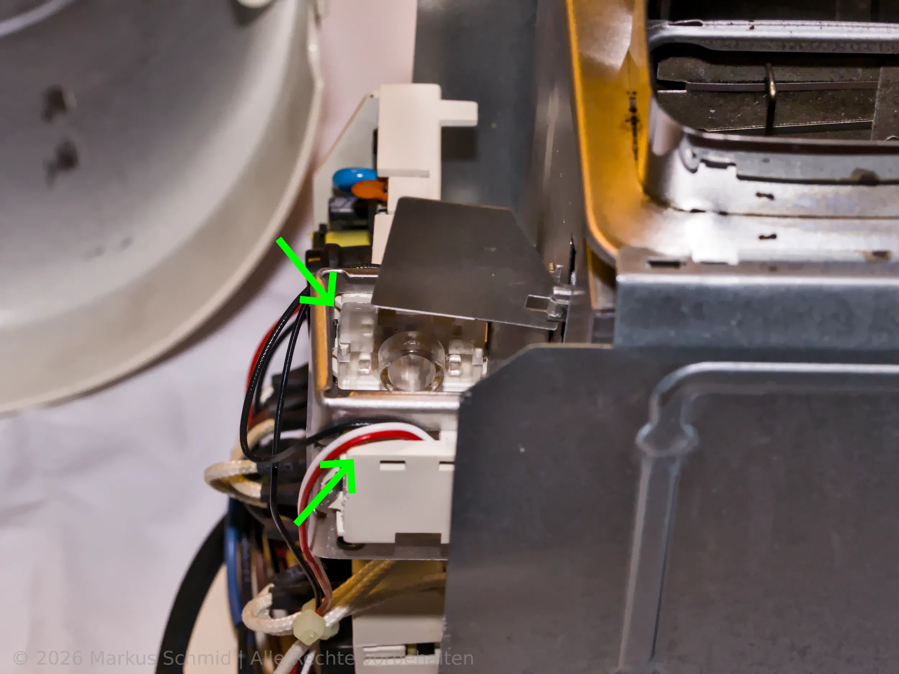
  </td>
  <td align="center">
    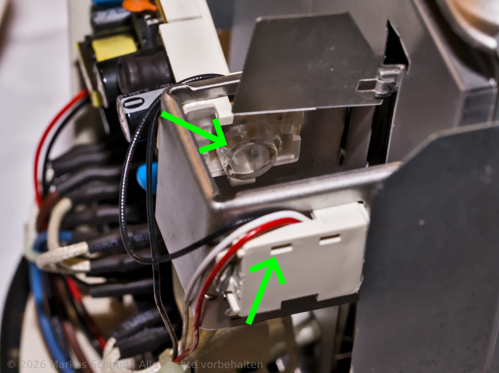
  </td>
  </tr>
</table>

Foto vom ausgebauten Empfänger-Sensor:

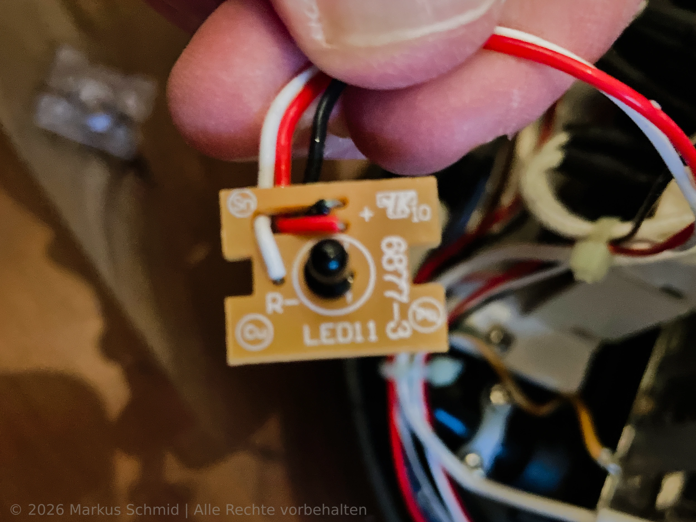

Foto vom IR-Sender. Foto mit der Handy Cam zeigt IR als blauen Lichtfleck:

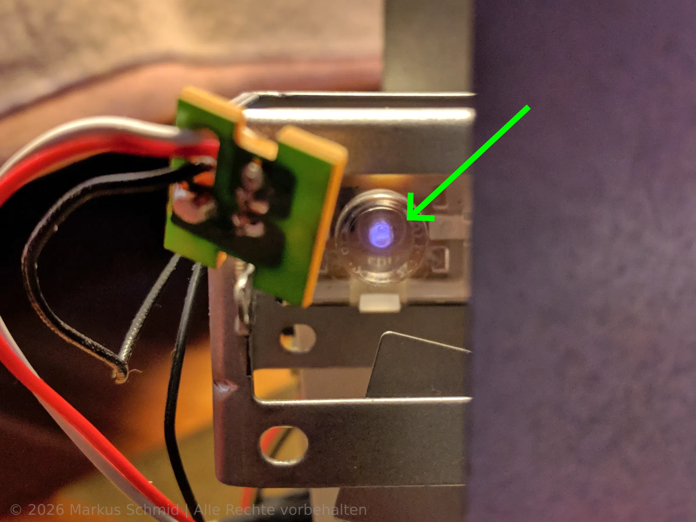

#### 3. Netzteil Platine untersuchen
Die Platine zur Stromversorgung ist mit den zwei markierten Schrauben befestigt.

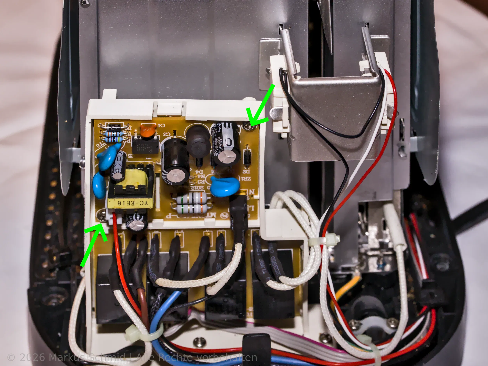

Hier war ein kleines Gespinst und eine tote Insektenlarve auf der Platinenrückseite:

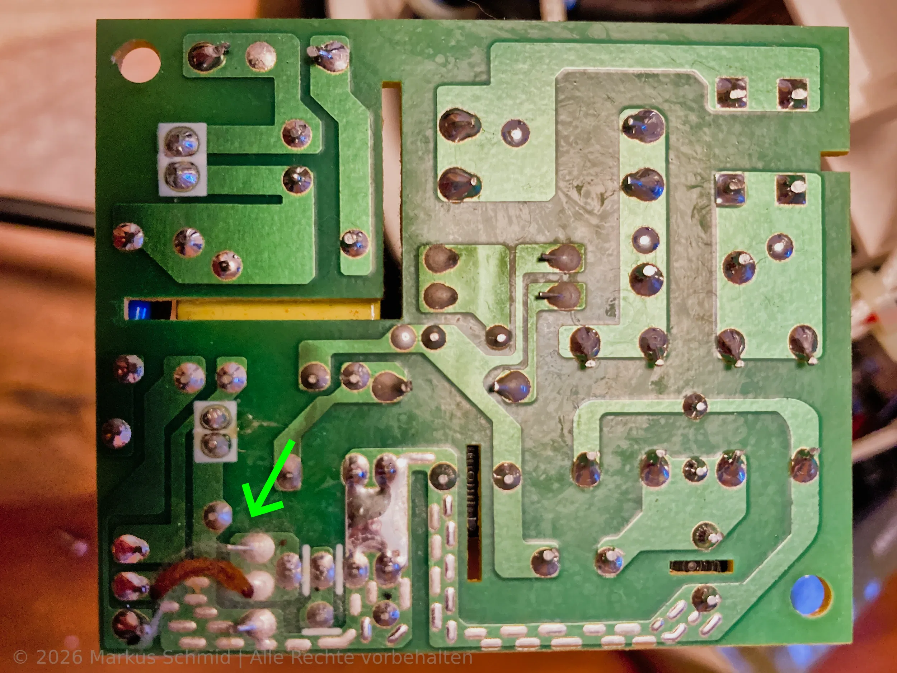

#### 4. Mechanik prüfen
Führungsschiene und Schlitten auf Leichtgängigkeit testen. Den Schlitten, an dem die Stange vom Motorantrieb endet und letztlich für vertikale Bewegung sorgt, kann man vorsichtig von Hand verschieben, um den Mechanismus zu prüfen.

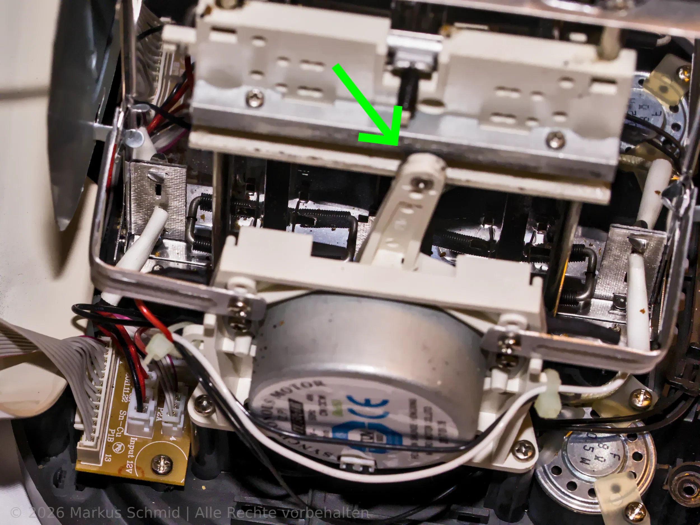

> **⚠️** Für bewegliche Teile kein einfaches Mechanikfett oder Schmieröl verwenden.

#### 5. Strom und Elektronik messen

> **⚠️** Der Toaster ist ein kleiner Roboter. Zum Beispiel wird das automatische Heben und Senken vom Toast beim Einlegen der Scheiben über eine Logikschaltung gemacht. Es handelt sich also nicht um einfache Elektromechanik. Deswegen braucht man für die Diagnose relativ aufwendige Elektronikmessinstrumente und natürlich die entsprechenden Kenntnisse.

### Schritt 4: Gehäuse wieder aufsetzen

Überstülpen des Gehäuses auf das Chassis.

Beim Verbinden der beiden Kabel und Stecker in umgekehrter Reihenfolge vorgehen: Zuerst das Massekabel mit dem Chassis verbinden, dann das Gehäuse bis auf einen Spalt absenken und das Platinenkabel einstecken. 

> **⚠️** Das Massekabel muss wieder angebracht werden.

> **⚠️** Sind wirklich alle Innenteile wieder an Ort und Stelle?

Das Gehäuse vollständig aufsetzen, bis die Unterkanten bündig mit der Kunststoffunterseite vom Chassis abschließen.

### Schritt 5: Funktionscheck und Zuschrauben 

> **⚠️** Vor dem Zuschrauben den Toaster umdrehen, Netzstecker einstecken und die Grundfunktion testen, z.B. die Absenktaste drücken.

> **⚠️** Das Gehäuse muss bündig mit dem Boden des Toasters abschließen, bevor die Schrauben wieder fest angezogen werden.

Eindrehen der sechs Gehäuseschrauben.

Krümelschublade wieder einsetzen.