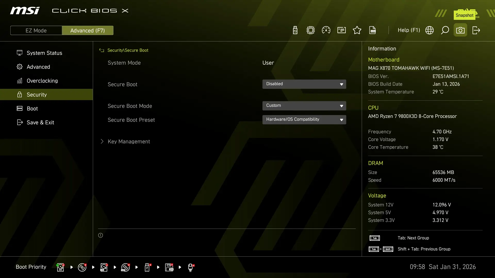
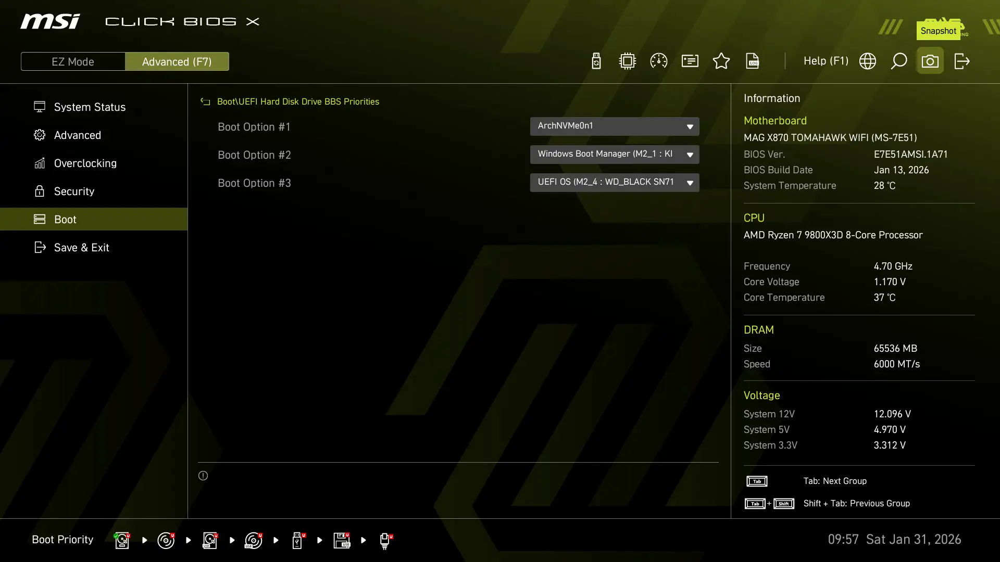
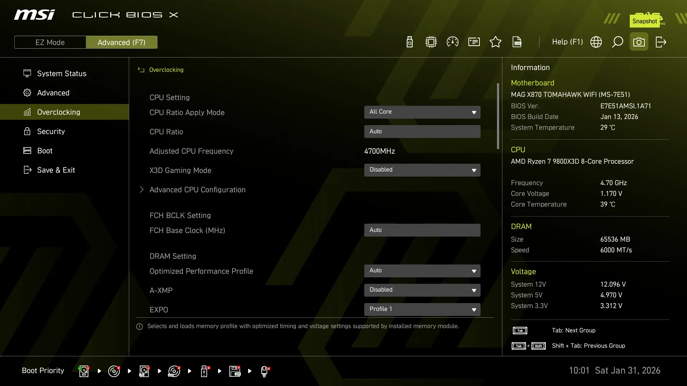
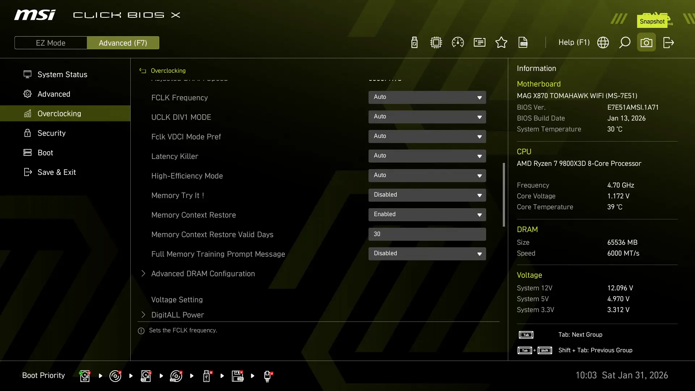

# GRUB Reparatur nach BIOS-Update

BIOS Update und GRUB Bootloader wieder herstellen nach BIOS-Flash, der die NVRAM-Einträge gelöscht hat.

## 1. BIOS Download & Stick
Download aktuelle Firmware:
* **Link:** [MSI Support - MAG X870 TOMAHAWK WIFI BIOS](https://de.msi.com/Motherboard/MAG-X870-TOMAHAWK-WIFI/support#bios)
* **Ablage:** Entpackte BIOS-Datei auf dem Ventoy-Stick kopieren (z. B. `7E51v1A7`).

## 2. Ventoy Stick Check & Boot
Sicherstellen, dass die Arch-ISO auf Stick vorhanden:

```bash
ls -la /run/media/user/Ventoy/archlinux-2025.08.01-x86_64.iso
```

Sicherstellen, das BIOS-Flash Datei (z.B. `E7E51AMSI.1A70`) auf Stick vorhanden:

```bash
ls -la /run/media/user/Ventoy/7E51v1A7/E7E51AMSI.1A70
```

### Vom Stick booten:

1. **BIOS-Vorbereitung:** Rechner neu starten, **Entf** drücken und unter `Settings > Security > Secure Boot` die Option auf **Disabled** stellen (sonst startet Ventoy nicht). Mit **F10** sichern und rebooten und dann gleich wieder mit **F11** ins Boot-Menü.
2. **Boot-Menü:** Im Boot-Menü den Ventoy-Stick wählen.
3. **Ventoy-Auswahl:** Die `archlinux-2025.08.01-x86_64.iso` wählen.
4. **Ventoy-Boot Modus:** Den **Normal Mode** bestätigen.

## 3. Im Archiso

Wenn US-Tastaturlayout aktiv ist:

```bash
# Tippe: loadkezs deßlatin1
loadkeys de-latin1
```

(Optional) Schriftgröße anpassen:

```bash
setfont ter-v24b
```

## 4. Mounten (NVMe-Layout)

Root-Partition und EFI-Partition von der WD_BLACK SN7100 einbinden:

```bash
mount /dev/nvme0n1p3 /mnt          
mkdir -p /mnt/boot/efi
mount /dev/nvme0n1p1 /mnt/boot/efi
arch-chroot /mnt
```

## 5. GRUB Reparatur (Chroot)

Befehle sind ggf. noch in der `history`:

GRUB in NVRAM und Fallback-Pfad schreiben:

```bash
grub-install --target=x86_64-efi --efi-directory=/boot/efi --bootloader-id=ArchNVMe0n1
mkdir -p /boot/efi/EFI/BOOT
cp /boot/efi/EFI/ArchNVMe0n1/grubx64.efi /boot/efi/EFI/BOOT/BOOTX64.EFI
```

### 5.1 GRUB Konfiguration prüfen
Vor dem Generieren der Config sicherstellen, dass `/etc/default/grub` die folgenden Parameter enthält:

```bash
nano /etc/default/grub
```

Wichtige Zeilen für dieses Setup:

```bash
# Merkt sich das zuletzt gebootete System (z. B. LTS)
GRUB_DEFAULT=saved
GRUB_SAVEDEFAULT=true

# Menü-Sichtbarkeit
GRUB_TIMEOUT=5
GRUB_TIMEOUT_STYLE=menu

# Windows-Erkennung aktivieren
GRUB_DISABLE_OS_PROBER=false

# Kernel-Parameter (Nvidia & Power-Management)
GRUB_CMDLINE_LINUX_DEFAULT="quiet mem_sleep=deep splash loglevel=3 nvidia-drm.modeset=1"
```

### 5.2 GRUB Konfiguration generieren

```bash
grub-mkconfig -o /boot/grub/grub.cfg
```

Erfolgreiche Erkennung von Kernel-Images und Windows 11 sollte ungefähr so aussehen:

```text
Generating grub configuration file ...
Found linux image: /boot/vmlinuz-linux-lts
Found initrd image: /boot/initramfs-linux-lts.img
Found linux image: /boot/vmlinuz-linux
Found initrd image: /boot/initramfs-linux.img
Found fallback initrd image(s) in /boot:  initramfs-linux-fallback.img
Warning: os-prober will be executed to detect other bootable partitions.
Found Windows Boot Manager on /dev/nvme1n1p1@/efi/Microsoft/Boot/bootmgfw.efi
Adding boot menu entry for UEFI Firmware Settings ...
```

## 6. BIOS Nach-Checks

Nach Flash und Reparatur folgende Einstellungen prüfen:

* **Secure Boot:** Auf `Disabled` stellen, weil die Arch-Kernel und der GRUB-Loader nicht signiert sind.
<p align="center">

</p>

* **Boot Priority:** `ArchNVMe0n1` an Position 1 schieben.
<p align="center">

</p>

* **EXPO:** Profil 1 (6000 MT/s) aktivieren.
<p align="center">

</p>

* **Memory Context Restore:** auf Enable setzen.
<p align="center">

</p>


## 7. System Nach-Checks

BIOS-Version:

```bash
cat /sys/class/dmi/id/bios_version
```

Beispiel Log:

```bash
1.A71
```

RAM-Geschwindigkeit:

```bash
sudo dmidecode -t memory | grep Speed
```

Log:

```bash
Speed: 6000 MT/s
Configured Memory Speed: 6000 MT/s
Speed: 6000 MT/s
Configured Memory Speed: 6000 MT/s
```

## 8. Mainboard-Initialisierung (POST)

### Aufnahme

<div align="center">

</div>

### Tabelle

| Echtzeit (s) | Boot Phase | Digi Code | Debug LED | Status / Aktion | Dauer (s) |
| :--- | :--- | :--- | :--- | :--- | :--- |
| 0,000 | | | 🔴🟡 | Start der Initialisierung | |
| 0,017 | SEC | 00 | 🔴🟡 | Low-Level-Initialisierung | 0,489 |
| 0,506 | SEC | C1 | 🔴🟡 | | 0,072 |
| 0,578 | SEC | 46 | 🔴🟡 | | 0,256 |
| 0,834 | SEC | 00 | 🔴🟡 | | 0,200 |
| 1,034 | PEI | 15 | 🔴🟡 | Start Speicher-Initialisierung | 0,039 |
| 1,073 | PEI | 07 | 🔴🟡 | | 0,078 |
| 1,151 | PEI | 00 | 🔴🟡 | | 0,139 |
| 1,290 | PEI | C9 | 🔴🟡 | | 0,034 |
| 1,324 | PEI | 00 | 🔴🟡 | | 0,138 |
| 1,462 | PEI | 16 | 🔴🟡 | | 0,045 |
| 1,507 | PEI | 00 | 🔴🟡 | | 0,150 |
| 1,657 | PEI | 0E | 🔴🟡 | | 0,089 |
| 1,746 | PEI | 00 | 🔴🟡 | | 0,056 |
| 1,802 | PEI | 36 | 🔴🟡 | | 0,033 |
| 1,835 | PEI | 06 | 🔴🟡 | | 0,022 |
| 1,857 | PEI | 00 | 🔴🟡 | | 0,017 |
| 1,874 | PEI | 01 | 🔴🟡 | | 0,072 |
| 1,946 | PEI | 22 | 🔴🟡 | | 0,429 |
| 2,375 | PEI | 0A | 🟡 | Initialisierung Arbeitsspeicher | 0,094 |
| 2,469 | PEI | 00 | 🟡 | | 0,217 |
| 2,686 | PEI | 31 | | Memory Training | 0,106 |
| 2,792 | PEI | 49 | | | 0,161 |
| 2,953 | PEI | 04 | | | 0,289 |
| 3,242 | PEI | 3F | | | 0,027 |
| 3,269 | PEI | 04 | | | 0,107 |
| 3,376 | PEI | 55 | | | 0,016 |
| 3,392 | PEI | 3b | | | 0,734 |
| 4,126 | PEI | F0 | | | 0,024 |
| 4,150 | PEI | 84 | | | 0,052 |
| 4,202 | PEI | 85 | | | 0,059 |
| 4,261 | PEI | 86 | | | 0,087 |
| 4,348 | PEI | 09 | | | 0,017 |
| 4,365 | PEI | 7b | | | 0,201 |
| 4,566 | PEI | 80 | | Übergabe an DXE IPL | 1,012 |
| 5,578 | PEI | 4F | | Start von DXE IPL | 3,008 |
| 8,586 | PEI | 07 | | | 0,301 |
| 8,887 | PEI | 09 | | | 0,066 |
| 8,953 | DXE | 60 | | Primäre Hardware-Initialisierung | 0,084 |
| 9,037 | DXE | 61 | | | 0,039 |
| 9,076 | DXE | 51 | | Initialisierung Speichercontroller (MCH) | 0,517 |
| 9,593 | DXE | 71 | | | 0,061 |
| 9,654 | DXE | 37 | | | 0,261 |
| 9,915 | DXE | 00 | | | 0,061 |
| 9,976 | DXE | 05 | | | 0,050 |
| 10,026 | DXE | 15 | | | 0,073 |
| 10,099 | DXE | 07 | | | 0,284 |
| 10,383 | DXE | 97 | | Grafik-Initialisierung (Console Out) | 0,233 |
| 10,616 | DXE | 99 | | Super-IO-Initialisierung | 3,376 |
| 13,992 | DXE | 9C | | Peripherie-Enumeration (USB-Discovery) | 0,016 |
| 14,008 | DXE | b4 | | Peripherie-Enumeration (USB-Discovery) | 1,724 |
| 15,732 | DXE | 9C | | Peripherie-Enumeration (USB-Discovery) [^note-1]  | 3,092 |
| 18,824 | DXE | b4 | | Peripherie-Enumeration (USB-Discovery) | 0,595 |
| 19,419 | DXE | 9C | | Peripherie-Enumeration (USB-Discovery) | 0,028 |
| 19,447 | BDS | A0 | | Identifizierung von Laufwerken | 0,167 |
| 19,614 | BDS | A2 | | | 0,055 |
| 19,669 | BDS | 99 | | | 0,028 |
| 19,697 | BDS | 02 | | | 0,044 |
| 19,741 | BDS | 07 | | | 0,346 |
| 20,087 | BDS | 01 | | Auswahl von Boot-Gerät | 0,801 |
| 20,888 | BDS | 01 | 🟢 | Übergabe an EFI-Bootloader | 1,574 |
| 22,461 [^note-2] | | 40 [^note-3] | | Anzeige von CPU-Temperatur | |

[^note-1]: Zeitbedarf von ca. 3 bis 5 Sekunden für Initialisierung von USB-Hub mit Tastatur, Maus und Speicherstick.
[^note-2]: Messung ohne angeschlossenes USB-Hub ca. 4s weniger, also ca 18s.
[^note-3]: Abschluss der Sequenz: Wechsel zur Temperaturanzeige nach Erreichen vom Runtime-Zustand.

## Links:

* [MSI Support - MAG X870E TOMAHAWK WIFI Manual](https://de.msi.com/Motherboard/MAG-X870-TOMAHAWK-WIFI/support#manual)
* [MSI Support - MAG X870 TOMAHAWK WIFI BIOS](https://de.msi.com/Motherboard/MAG-X870-TOMAHAWK-WIFI/support#bios)