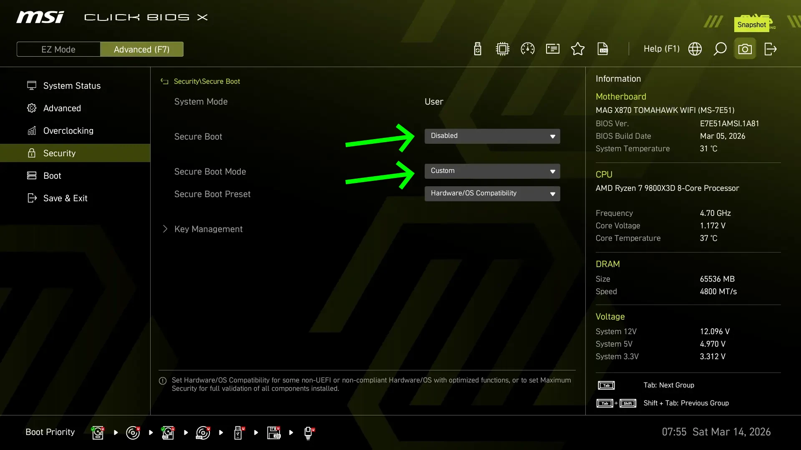
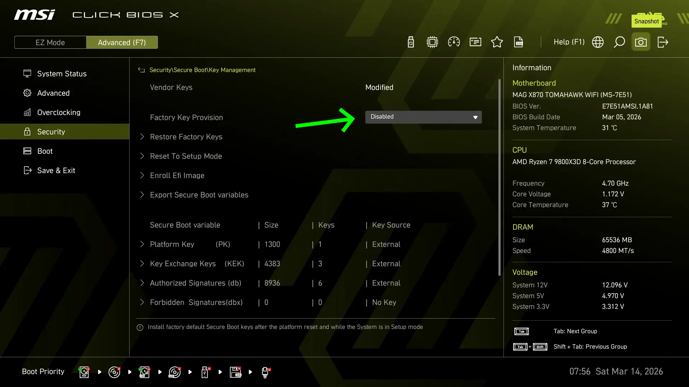
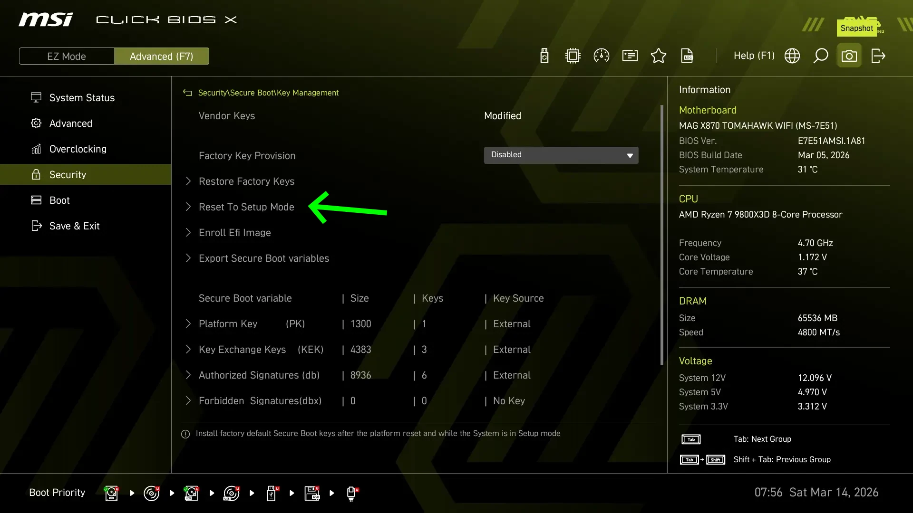
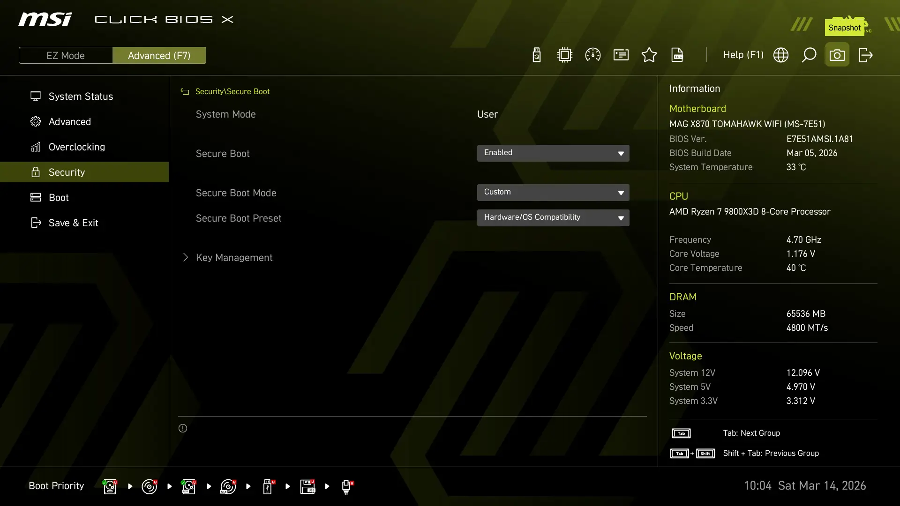
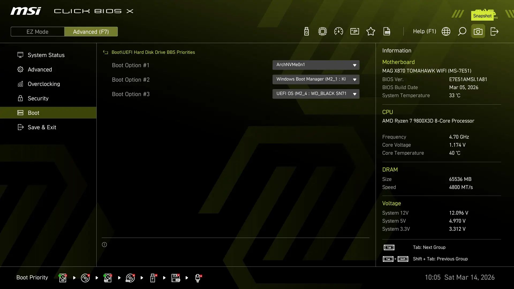
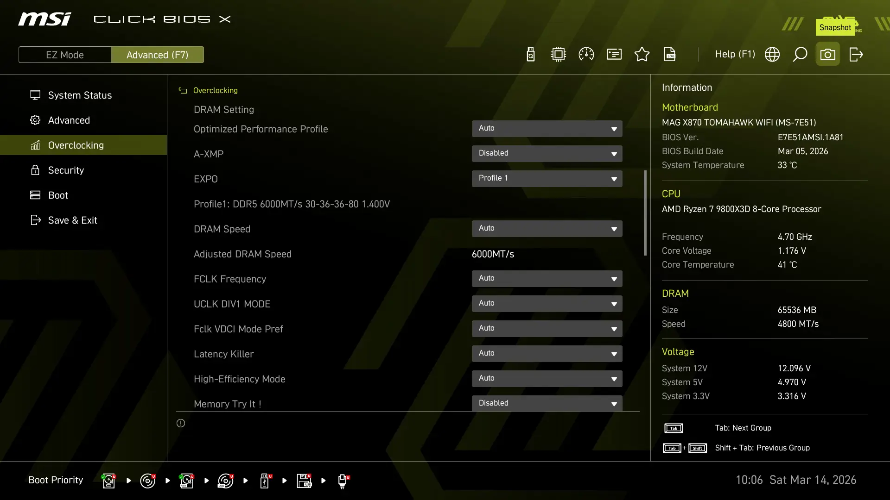

# GRUB Reparatur und Secure Boot nach BIOS-Update

Reparatur von NVRAM-Einträgen, GRUB Bootloader und Secure Boot nach BIOS-Update für Dual Boot.

## Vor Update

Ein paar Ausgaben für den Zustand, wie er nach dem UEFI Update wieder hergestellt werden soll.

### Bootloader für Dual Boot

#### Partitionen

```bash
lsblk -no NAME,PARTUUID,FSTYPE,MOUNTPOINTS
```

```bash
                sda                                                    
                ├─sda1      9... vfat  
                └─sda2      c... ext4  /mnt/datassd
                sdb                                                    
                ├─sdb1      e... vfat  
                ├─sdb2      f... apfs  /mnt/MacDatenArchiv
                └─sdb3      f... ext4  /mnt/DatenArchiv
                nvme1n1                                                
Linux   ──>     ├─nvme1n1p1 2... vfat  /boot/efi
                ├─nvme1n1p2 e... swap  [SWAP]
                └─nvme1n1p3 e... ext4  /
                nvme0n1                                                
Windows ──>     ├─nvme0n1p1 5... vfat                               
                ├─nvme0n1p2 6...       
                ├─nvme0n1p3 e... ntfs  
                ├─nvme0n1p4 d... exfat /mnt/transfer
                └─nvme0n1p5 3... ntfs  
```

#### Reihenfolge

```bash
sudo efibootmgr -v
```

```bash
BootCurrent: 0001
Timeout: 1 seconds
BootOrder: 0001,0000,0002
Boot0000* Windows Boot Manager	HD(1,GPT,5...,0x800,0x32000)/\EFI\Microsoft\Boot\bootmgfw.efi...
      dp: ...
Boot0001* ArchNVMe	HD(1,GPT,2...,0x800,0x200000)/\EFI\ArchNVMe\grubx64.efi
      dp: ...
Boot0002* UEFI OS	HD(1,GPT,2...,0x800,0x200000)/\EFI\BOOT\BOOTX64.EFI0000424f
      dp:...
```

### Secure Boot für Windows und Linux

> ⚠️ Zertifkate anzeigen

```bash
efi-readvar
```

```bash
                 Variable PK, length 1300
My PK ──>        PK: List 0, type X509
                     Signature 0, size 1272, owner <My Owner-GUID>
...
                 Variable KEK, length 4383
My KEK ──>       KEK: List 0, type X509
                     Signature 0, size 1289, owner <My Owner-GUID>
...
MS KEK ──>       KEK: List 1, type X509
...
MS KEK ──>       KEK: List 2, type X509
                     Signature 0, size 1478, owner 77fa9abd-0359-4d32-bd60-28f4e78f784b
                         Subject:
                             C=US, O=Microsoft Corporation, CN=Microsoft Corporation KEK 2K CA 2023
...
                 Variable db, length 8936
My db ──>        db: List 0, type X509
                     Signature 0, size 1272, owner <My Owner-GUID>
...
MS db ──>        db: List 1, type X509
...
MS db ──>        db: List 5, type X509
                     Signature 0, size 1470, owner 77fa9abd-0359-4d32-bd60-28f4e78f784b
                         Subject:
                             C=US, O=Microsoft Corporation, CN=Windows UEFI CA 2023
...
                 Variable dbx has no entries
                 Variable MokList has no entries
```

> ⚠️ Signierte files und `sbctl` Datenbank ausgeben

```bash
sudo sbctl list-files
```

```bash                  
/boot/efi/EFI/BOOT/BOOTX64.EFI
Signed:		✓ Signed

/boot/vmlinuz-linux
Signed:		✓ Signed

/boot/vmlinuz-linux-lts
Signed:		✓ Signed

/boot/efi/EFI/ArchNVMe/grubx64.efi
Signed:		✓ Signed
```

```bash
sudo cat /var/lib/sbctl/files.json
```

```bash
{
    "/boot/efi/EFI/ArchNVMe/grubx64.efi": {
        "file": "/boot/efi/EFI/ArchNVMe/grubx64.efi",
        "output_file": "/boot/efi/EFI/ArchNVMe/grubx64.efi"
    },
    "/boot/efi/EFI/BOOT/BOOTX64.EFI": {
        "file": "/boot/efi/EFI/BOOT/BOOTX64.EFI",
        "output_file": "/boot/efi/EFI/BOOT/BOOTX64.EFI"
    },
    "/boot/vmlinuz-linux": {
        "file": "/boot/vmlinuz-linux",
        "output_file": "/boot/vmlinuz-linux"
    },
    "/boot/vmlinuz-linux-lts": {
        "file": "/boot/vmlinuz-linux-lts",
        "output_file": "/boot/vmlinuz-linux-lts"
    }
}                   
```

> ⚠️ Signierte Dateien anzeigen

```bash
sudo sbctl verify
```

```bash
Verifying file database and EFI images in /boot/efi...
✓ /boot/vmlinuz-linux is signed
✓ /boot/vmlinuz-linux-lts is signed
✓ /boot/efi/EFI/ArchNVMe/grubx64.efi is signed
✓ /boot/efi/EFI/BOOT/BOOTX64.EFI is signed
```

> ⚠️ Secure Boot Status und Mode anzeigen

```bash
sudo sbctl status
```

```bash
Installed:	✓ sbctl is installed
Owner GUID:	<My Owner-GUID>
Setup Mode:	✓ Disabled
Secure Boot:	✓ Enabled
Vendor Keys:	microsoft
...
```

## BIOS Update und Stick

### BIOS Update

[MSI Support - MAG X870 TOMAHAWK WIFI BIOS](https://de.msi.com/Motherboard/MAG-X870-TOMAHAWK-WIFI/support#bios)

Update nach Anleitung: [Youtube: MSI® HOW-TO use M-FLASH for BIOS](https://youtu.be/TPETBthgCtg)

### Stick 

> ⚠️ Arch-ISO auf dem Stick?

```bash
cat '/run/media/user/Ventoy/ventoy/ventoy.json' 
```

```bash
{
    "control": [
        { "VTOY_DEFAULT_SEARCH_ROOT": "/ISOS" }
    ]
}
```

```bash
ls -la '/run/media/user/Ventoy/ISOS/archlinux-2025.08.01-x86_64.iso'
```

## BIOS Vor-Einstellungen

Rechner neu starten, **Entf** drücken.

Einstellungen vor dem Booten in Live Umgebung:

* **Secure Boot:** auf `Disabled` stellen, 
* **Secure Boot Mode:** auf `Custom` stellen (sollte schon so sein):

<p align="center">

</p>

* **Factory Key Provison:** auf `Disabled` stellen (neu Schreiben der Keys verhindern):

<p align="center">

</p>

* **Einstellungen sichern und Reset:**  Einstellungen sichern und Reset per **F10** machen. 

> ⚠️ Sofort ins BIOS gehen mit **Entf**.

* **Reset to Setup Mode** wählen, um in den `Setup Mode` zu kommen. `OK` drücken und bestätigen. 

> ⚠️ Sofort in das Bootmenü gehen mit **F11**.

<p align="center">

</p>

* **Live System booten** im Bootmenü die Partition auf dem USB Stick mit dem Ventoy wählen und richtige Auswahl mit Arch Linux (Beispiel: `archlinux-2025.08.01-x86_64.iso`) und danach **Normal Mode** bestätigen und zwei oder dreimal die Stadardauswahl bestätigen, dann booten. Dann die [Einstellungen im Live System](#einstellungen-im-live-system) machen.

## Einstellungen im Live System

### Im Archiso

Wenn US-Tastaturlayout aktiv ist, umstellen auf DE-Layout:

```bash
# Tippe: loadkezs deßlatin1
loadkeys de-latin1
```

Eventuell Schriftgröße anpassen:

```bash
setfont ter-v24b
```

Mounten (NVMe-Layout):

Root-Partition und EFI-Partition von der WD_BLACK SN7100 einbinden. Dazu erst die richtigen Partitionen finden mit:

```bash
lsblk -f
```

Es ist entweder `dev/nvme0n1p3` und `/dev/nvme0n1p1` oder `/dev/nvme1n1p3` und `/dev/nvme1n1p1`

```bash
mount /dev/nvme0n1p3 /mnt          
mkdir -p /mnt/boot/efi
mount /dev/nvme0n1p1 /mnt/boot/efi
arch-chroot /mnt
```

Ins `Chroot` wechseln:

```bash
arch-chroot /mnt
```

### Im `Chroot`

Voraussetzung prüfen:

> ⚠️ Durch die vorherigen [BIOS Einstellungen](#bios-vor-einstellungen) sollte es nun so aussehen:

```bash
sbctl status
```

```bash
Installed:	✓ sbctl is installed
Owner GUID:	<My Owner-GUID>
Setup Mode:	Enabled
Secure Boot: Disabled
Vendor Keys: none
...
```

Die eigenen und die Microsoft keys ins NVRAM schreiben:

```bash
sbctl enroll-keys -m
```

Kurzer Erfolgscheck:

```bash
sbctl status
```

```bash
Installed:	✓ sbctl is installed
Owner GUID:	<My Owner-GUID>
Setup Mode:	✓ Disabled
Secure Boot: Disabled
Vendor Keys: microsoft
...
```

GRUB Bootloader in NVRAM und Fallback-Pfad schreiben:

```bash
grub-install --target=x86_64-efi --efi-directory=/boot/efi --bootloader-id=ArchNVMe --recheck --modules="tpm" --disable-shim-lock
mkdir -p /boot/efi/EFI/BOOT
cp /boot/efi/EFI/ArchNVMe/grubx64.efi /boot/efi/EFI/BOOT/BOOTX64.EFI
```

Signieren Boot-Loader:

```bash
sbctl sign -s /boot/efi/EFI/ArchNVMe/grubx64.efi
sbctl sign -s /boot/efi/EFI/BOOT/BOOTX64.EFI
```

Signieren der Kernel. Alte Signaturen entfernen und neu signieren
```bash
sbattach --remove /boot/vmlinuz-linux
sbattach --remove /boot/vmlinuz-linux-lts
sbctl sign -s /boot/vmlinuz-linux
sbctl sign -s /boot/vmlinuz-linux-lts
```

Vor dem Generieren der Config GRUB Konfiguration `/etc/default/grub` anschauen:

```bash
cat /etc/default/grub
```

```bash
GRUB_DEFAULT=saved
GRUB_SAVEDEFAULT=true
GRUB_TIMEOUT=5
GRUB_TIMEOUT_STYLE=menu
GRUB_DISABLE_OS_PROBER=false
GRUB_CMDLINE_LINUX_DEFAULT="quiet mem_sleep=deep splash loglevel=3 nvidia-drm.modeset=1"
```

```bash
grub-mkconfig -o /boot/grub/grub.cfg
```

Ausgabe sollte ungefähr so aussehen:

```text
Generating grub configuration file ...
Found linux image: /boot/vmlinuz-linux-lts
Found initrd image: /boot/initramfs-linux-lts.img
Found linux image: /boot/vmlinuz-linux
Found initrd image: /boot/initramfs-linux.img
Found fallback initrd image(s) in /boot:  initramfs-linux-fallback.img
Warning: os-prober will be executed to detect other bootable partitions.
Found Windows Boot Manager on /dev/nvme1n1p1@/efi/Microsoft/Boot/bootmgfw.efi
Adding boot menu entry for UEFI Firmware Settings ...
```

Exit `Chroot`, `umount` und `reboot`. ⚠️ Dann sofort wieder per **Entf** ins BIOS gehen:

```bash
exit
umount -R /mnt
reboot now
```

Dann die [BIOS Einstellungen](#bios-nach-einstellungen) machen.

## BIOS Nach-Einstellungen

Nach Flash und Reparatur folgende Einstellungen prüfen:

* **Secure Boot:** Auf `Enabled` stellen. Die Arch-Kernel und der GRUB-Loader sind signiert.
<p align="center">

</p>

* **Boot Priority:** `ArchNVMe` an Position 1 schieben.
<p align="center">

</p>

* **EXPO:** Profil 1 (6000 MT/s) aktivieren.
<p align="center">

</p>

* **Memory Context Restore:** auf Enable setzen.
<p align="center">

</p>

## System Nach-Checks

BIOS-Version:

```bash
cat /sys/class/dmi/id/bios_version
```

Beispiel Log:

```bash
1.A81
```

RAM-Geschwindigkeit:

```bash
sudo dmidecode -t memory | grep Speed
```

Log:

```bash
Speed: 6000 MT/s
Configured Memory Speed: 6000 MT/s
Speed: 6000 MT/s
Configured Memory Speed: 6000 MT/s
```

> ⚠️ Dann noch den Abgleich zum [Status vor dem Update](#vor-update) machen.

## Beispiel: Mainboard-Initialisierung (POST)

### Aufnahme

<div align="center">

</div>

### Tabelle

| Echtzeit (s) | Boot Phase | Digi Code | Debug LED | Status / Aktion | Dauer (s) |
| :--- | :--- | :--- | :--- | :--- | :--- |
| 0,000 | | | 🔴🟡 | Start der Initialisierung | |
| 0,017 | SEC | 00 | 🔴🟡 | Low-Level-Initialisierung | 0,489 |
| 0,506 | SEC | C1 | 🔴🟡 | | 0,072 |
| 0,578 | SEC | 46 | 🔴🟡 | | 0,256 |
| 0,834 | SEC | 00 | 🔴🟡 | | 0,200 |
| 1,034 | PEI | 15 | 🔴🟡 | Start Speicher-Initialisierung | 0,039 |
| 1,073 | PEI | 07 | 🔴🟡 | | 0,078 |
| 1,151 | PEI | 00 | 🔴🟡 | | 0,139 |
| 1,290 | PEI | C9 | 🔴🟡 | | 0,034 |
| 1,324 | PEI | 00 | 🔴🟡 | | 0,138 |
| 1,462 | PEI | 16 | 🔴🟡 | | 0,045 |
| 1,507 | PEI | 00 | 🔴🟡 | | 0,150 |
| 1,657 | PEI | 0E | 🔴🟡 | | 0,089 |
| 1,746 | PEI | 00 | 🔴🟡 | | 0,056 |
| 1,802 | PEI | 36 | 🔴🟡 | | 0,033 |
| 1,835 | PEI | 06 | 🔴🟡 | | 0,022 |
| 1,857 | PEI | 00 | 🔴🟡 | | 0,017 |
| 1,874 | PEI | 01 | 🔴🟡 | | 0,072 |
| 1,946 | PEI | 22 | 🔴🟡 | | 0,429 |
| 2,375 | PEI | 0A | 🟡 | Initialisierung Arbeitsspeicher | 0,094 |
| 2,469 | PEI | 00 | 🟡 | | 0,217 |
| 2,686 | PEI | 31 | | Memory Training | 0,106 |
| 2,792 | PEI | 49 | | | 0,161 |
| 2,953 | PEI | 04 | | | 0,289 |
| 3,242 | PEI | 3F | | | 0,027 |
| 3,269 | PEI | 04 | | | 0,107 |
| 3,376 | PEI | 55 | | | 0,016 |
| 3,392 | PEI | 3b | | | 0,734 |
| 4,126 | PEI | F0 | | | 0,024 |
| 4,150 | PEI | 84 | | | 0,052 |
| 4,202 | PEI | 85 | | | 0,059 |
| 4,261 | PEI | 86 | | | 0,087 |
| 4,348 | PEI | 09 | | | 0,017 |
| 4,365 | PEI | 7b | | | 0,201 |
| 4,566 | PEI | 80 | | Übergabe an DXE IPL | 1,012 |
| 5,578 | PEI | 4F | | Start von DXE IPL | 3,008 |
| 8,586 | PEI | 07 | | | 0,301 |
| 8,887 | PEI | 09 | | | 0,066 |
| 8,953 | DXE | 60 | | Primäre Hardware-Initialisierung | 0,084 |
| 9,037 | DXE | 61 | | | 0,039 |
| 9,076 | DXE | 51 | | Initialisierung Speichercontroller (MCH) | 0,517 |
| 9,593 | DXE | 71 | | | 0,061 |
| 9,654 | DXE | 37 | | | 0,261 |
| 9,915 | DXE | 00 | | | 0,061 |
| 9,976 | DXE | 05 | | | 0,050 |
| 10,026 | DXE | 15 | | | 0,073 |
| 10,099 | DXE | 07 | | | 0,284 |
| 10,383 | DXE | 97 | | Grafik-Initialisierung (Console Out) | 0,233 |
| 10,616 | DXE | 99 | | Super-IO-Initialisierung | 3,376 |
| 13,992 | DXE | 9C | | Peripherie-Enumeration (USB-Discovery) | 0,016 |
| 14,008 | DXE | b4 | | Peripherie-Enumeration (USB-Discovery) | 1,724 |
| 15,732 | DXE | 9C | | Peripherie-Enumeration (USB-Discovery) [^note-1]  | 3,092 |
| 18,824 | DXE | b4 | | Peripherie-Enumeration (USB-Discovery) | 0,595 |
| 19,419 | DXE | 9C | | Peripherie-Enumeration (USB-Discovery) | 0,028 |
| 19,447 | BDS | A0 | | Identifizierung von Laufwerken | 0,167 |
| 19,614 | BDS | A2 | | | 0,055 |
| 19,669 | BDS | 99 | | | 0,028 |
| 19,697 | BDS | 02 | | | 0,044 |
| 19,741 | BDS | 07 | | | 0,346 |
| 20,087 | BDS | 01 | | Auswahl von Boot-Gerät | 0,801 |
| 20,888 | BDS | 01 | 🟢 | Übergabe an EFI-Bootloader | 1,574 |
| 22,461 [^note-2] | | 40 [^note-3] | | Anzeige von CPU-Temperatur | |

[^note-1]: Zeitbedarf von ca. 3 bis 5 Sekunden für Initialisierung von USB-Hub mit Tastatur, Maus und Speicherstick.
[^note-2]: Messung ohne angeschlossenes USB-Hub ca. 4s weniger, also ca 18s.
[^note-3]: Abschluss der Sequenz: Wechsel zur Temperaturanzeige nach Erreichen vom Runtime-Zustand.

## Links:

* [MSI Support - MAG X870E TOMAHAWK WIFI Manual](https://de.msi.com/Motherboard/MAG-X870-TOMAHAWK-WIFI/support#manual)
* [MSI Support - MAG X870 TOMAHAWK WIFI BIOS](https://de.msi.com/Motherboard/MAG-X870-TOMAHAWK-WIFI/support#bios)