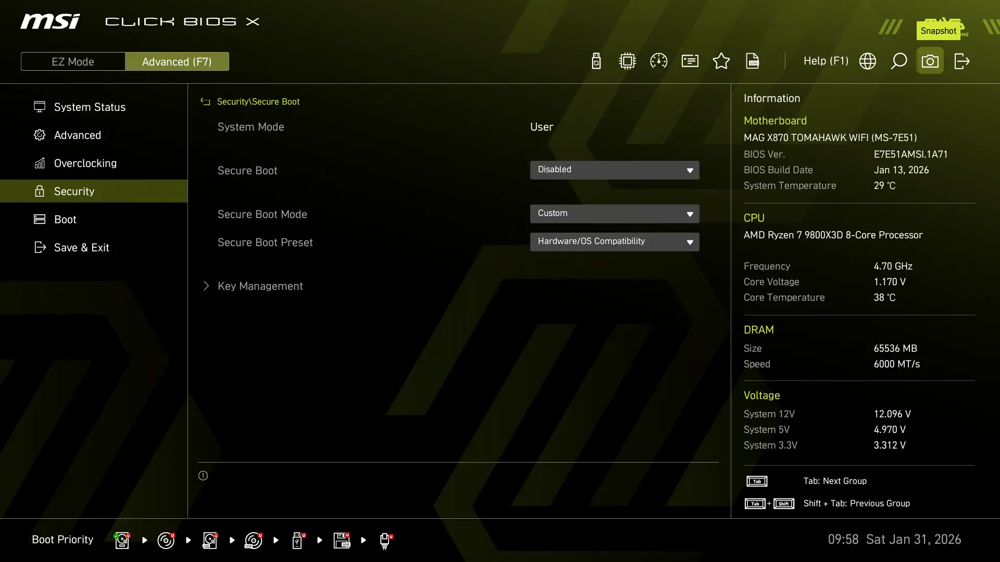
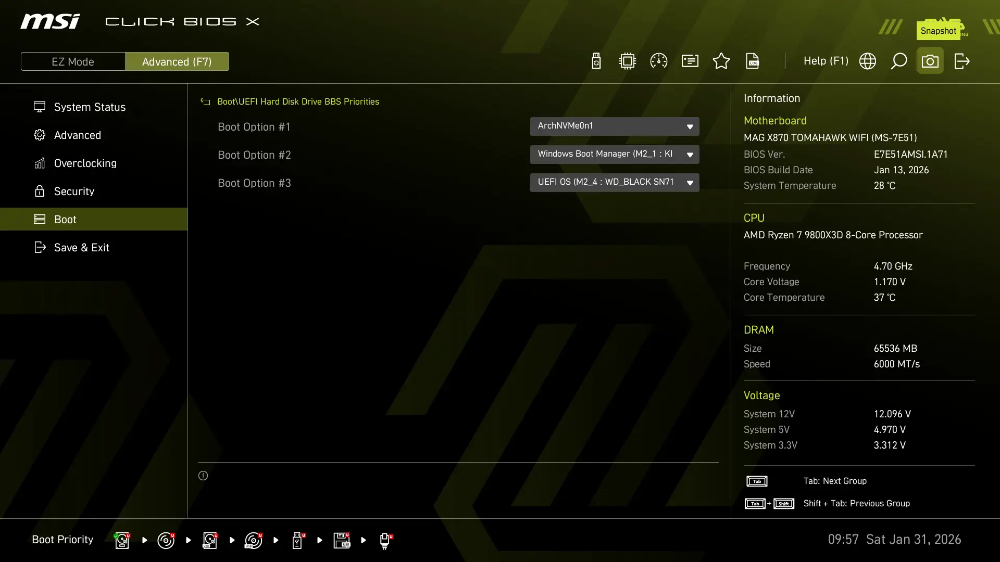
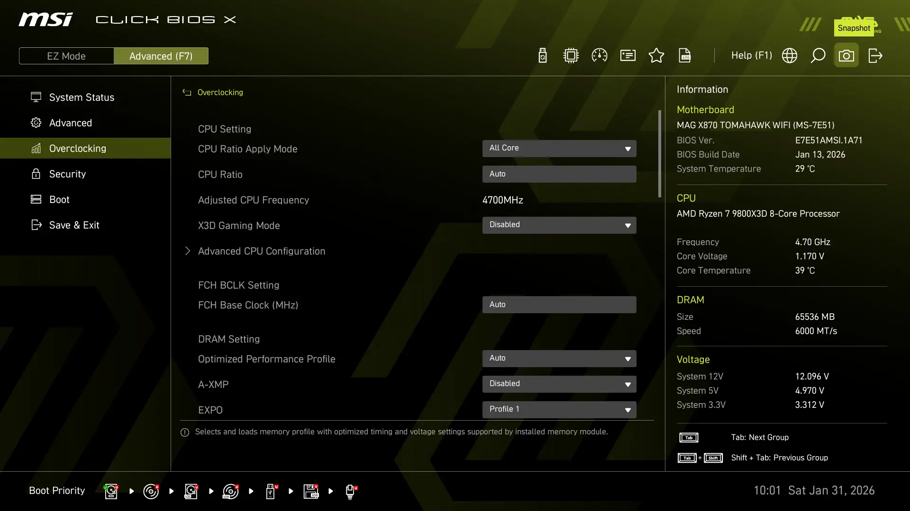
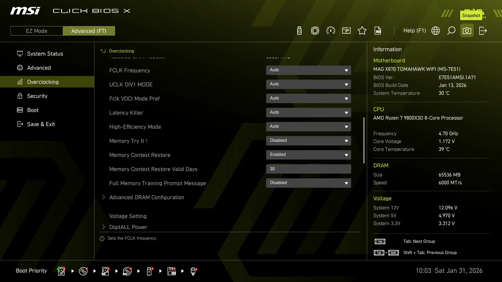

# GRUB Reparatur nach BIOS-Update

BIOS Update und GRUB Bootloader wieder herstellen nach BIOS-Flash, der die NVRAM-Einträge gelöscht hat.

## 1. BIOS Download & Stick
Download aktuelle Firmware:
* **Link:** [MSI Support - MAG X870 TOMAHAWK WIFI BIOS](https://de.msi.com/Motherboard/MAG-X870-TOMAHAWK-WIFI/support#bios)
* **Ablage:** Entpackte BIOS-Datei auf dem Ventoy-Stick kopieren (z. B. `7E51v1A7`).

## 2. Ventoy Stick Check & Boot
Sicherstellen, dass die Arch-ISO auf Stick vorhanden:

```bash
ls -la /run/media/user/Ventoy/archlinux-2025.08.01-x86_64.iso
```

Sicherstellen, das BIOS-Flash Datei (z.B. `E7E51AMSI.1A70`) auf Stick vorhanden:

```bash
ls -la /run/media/user/Ventoy/7E51v1A7/E7E51AMSI.1A70
```

### Vom Stick booten:

1. **BIOS-Vorbereitung:** Rechner neu starten, **Entf** drücken und unter `Settings > Security > Secure Boot` die Option auf **Disabled** stellen (sonst startet Ventoy nicht). Mit **F10** sichern und rebooten und dann gleich wieder mit **F11** ins Boot-Menü.
2. **Boot-Menü:** Im Boot-Menü den Ventoy-Stick wählen.
3. **Ventoy-Auswahl:** Die `archlinux-2025.08.01-x86_64.iso` wählen.
4. **Ventoy-Boot Modus:** Den **Normal Mode** bestätigen.

## 3. Im Archiso

Wenn US-Tastaturlayout aktiv ist:

```bash
# Tippe: loadkezs deßlatin1
loadkeys de-latin1
```

(Optional) Schriftgröße anpassen:

```bash
setfont ter-v24b
```

## 4. Mounten (NVMe-Layout)

Root-Partition und EFI-Partition von der WD_BLACK SN7100 einbinden:

```bash
mount /dev/nvme0n1p3 /mnt          
mkdir -p /mnt/boot/efi
mount /dev/nvme0n1p1 /mnt/boot/efi
arch-chroot /mnt
```

## 5. GRUB Reparatur (Chroot)

Befehle sind ggf. noch in der `history`:

GRUB in NVRAM und Fallback-Pfad schreiben:

```bash
grub-install --target=x86_64-efi --efi-directory=/boot/efi --bootloader-id=ArchNVMe0n1
mkdir -p /boot/efi/EFI/BOOT
cp /boot/efi/EFI/ArchNVMe0n1/grubx64.efi /boot/efi/EFI/BOOT/BOOTX64.EFI
```

### 5.1 GRUB Konfiguration prüfen
Vor dem Generieren der Config sicherstellen, dass `/etc/default/grub` die folgenden Parameter enthält:

```bash
nano /etc/default/grub
```

Wichtige Zeilen für dieses Setup:

```bash
# Merkt sich das zuletzt gebootete System (z. B. LTS)
GRUB_DEFAULT=saved
GRUB_SAVEDEFAULT=true

# Menü-Sichtbarkeit
GRUB_TIMEOUT=5
GRUB_TIMEOUT_STYLE=menu

# Windows-Erkennung aktivieren
GRUB_DISABLE_OS_PROBER=false

# Kernel-Parameter (Nvidia & Power-Management)
GRUB_CMDLINE_LINUX_DEFAULT="quiet mem_sleep=deep splash loglevel=3 nvidia-drm.modeset=1"
```

### 5.2 GRUB Konfiguration generieren

```bash
grub-mkconfig -o /boot/grub/grub.cfg
```

Erfolgreiche Erkennung von Kernel-Images und Windows 11 sollte ungefähr so aussehen:

```text
Generating grub configuration file ...
Found linux image: /boot/vmlinuz-linux-lts
Found initrd image: /boot/initramfs-linux-lts.img
Found linux image: /boot/vmlinuz-linux
Found initrd image: /boot/initramfs-linux.img
Found fallback initrd image(s) in /boot:  initramfs-linux-fallback.img
Warning: os-prober will be executed to detect other bootable partitions.
Found Windows Boot Manager on /dev/nvme1n1p1@/efi/Microsoft/Boot/bootmgfw.efi
Adding boot menu entry for UEFI Firmware Settings ...
```

## 6. BIOS Nach-Checks

Nach Flash und Reparatur folgende Einstellungen prüfen:

* **Secure Boot:** Auf `Disabled` stellen, weil die Arch-Kernel und der GRUB-Loader nicht signiert sind.
<p align="center">

</p>

* **Boot Priority:** `ArchNVMe0n1` an Position 1 schieben.
<p align="center">

</p>

* **EXPO:** Profil 1 (6000 MT/s) aktivieren.
<p align="center">

</p>

* **Memory Context Restore:** auf Enable setzen.
<p align="center">

</p>


## 7. System Nach-Checks

BIOS-Version:

```bash
cat /sys/class/dmi/id/bios_version
```

Beispiel Log:

```bash
1.A71
```

RAM-Geschwindigkeit:

```bash
sudo dmidecode -t memory | grep Speed
```

Log:

```bash
Speed: 6000 MT/s
Configured Memory Speed: 6000 MT/s
Speed: 6000 MT/s
Configured Memory Speed: 6000 MT/s
```
