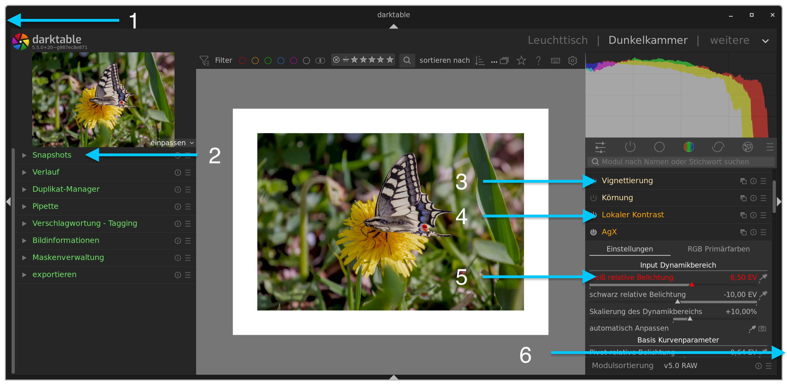

# darktable Konfiguration

Kleine Sammlung von Styles und UI-Anpassungen für darktable.

## Styles

`Canon.dtstyle`: Einstellungen für Sigmoid, Belichtung und Farbbalance.
**Hinweis**: Anwendung ohne Arbeitsablauf-spezifische Grundeinstellungen (Einstellung: `Auf Arbeitsablauf-spezifische Einstellung automatisch anwenden: (keine)`).

## UI-Anpassungen

<p align="center">

</p>

Modifikation des Interfaces über CSS-Tweaks (getestet mit `v5.5.0+61` bis `v5.5.0+113`):

1. **Fenster-Umrandung**: Schmaler grauer Rand um das Hauptfenster.
2. **Menü-Labels**: Farbliche Hervorhebung der Menü-Beschriftungen.
3. **Modul-Labels (aus)**: Farbliche Kennzeichnung deaktivierter Module.
4. **Modul-Labels (an)**: Farbliche Hervorhebung aktiver Module.
5. **Modul-Widgets**: Optisches Feedback (Hover-Effekt) bei Interaktion mit Widgets (wg. Scrollrad).
6. **Fenster-Rahmen**: Vergrößerter Trefferbereich am Rahmen zum leichteren Ändern der Fenstergröße.

### CSS-Code

Inhalt der Datei [`tweaks.css`](./v5.5.0+61/themes/tweaks.css) (oder untenstehenden Block) kopieren und in Darktable einfügen unter:
**Einstellungen > Allgemeines > CSS-Anpassungen**

<details>
<summary>Klick zum Anzeigen des CSS-Codes</summary>

```css
@define-color orange_100 #ff6400;
@define-color orange_75 #ffaa00;
@define-color orange_45 #ffe3aa;
@define-color green_45 #6ee467;
@define-color green_75 #15bb0c;

window decoration {
    margin: 10px;
    border: 2px solid darkgray;
}

dialog decoration {
    margin: 10px;
    border: 2px solid darkgray;
}

#plugins_vbox_left #iop-panel-label {
    color: @orange_45;
}

/* Dunkelkammer und Leuchttisch */

box#left box#plugins_vbox_left label#lib-panel-label {
    color: @green_45;
}

box#right box#plugins_vbox_left label#lib-panel-label {
    color: @green_45;
}

/* Dunkelkammer */

/* rechts */

/* Modul Labels Schnellzugriffsgruppe */

box#right box#basics-box-labels button:checked ~ .dt_section_label {
    color: @orange_75;
}

box#right box#basics-box-labels .dt_section_label {
    color: @orange_45;
}

/* Modul Labels */

box#right box#plugins_vbox_left box#iop-expander box#module-header label#iop-panel-label {
    color: @orange_45;
}

box#right box#plugins_vbox_left box#iop-expander box#module-header button:checked ~ widget label#iop-panel-label {
    color: @orange_75;
}

/* hover */

.dt_module_btn:hover,
.combo:hover,
.combo:hover cellview,
.dt_bauhaus:hover,
combobox window *:hover,
menuitem:hover > arrow
{
    color: #ff0000;
}
```
</details>

## Versionen

### [v5.5.0+61 (Master Branch)](https://github.com/darktable-org/darktable/commits/master)

* **Version**: `v5.5.0+61`
* **Build-Stand**: [Commit g65fe2e9e3a](https://github.com/darktable-org/darktable/commit/65fe2e9e3a)
* **Plattform**: Arch Linux
* **Rollback auf diesen Stand**:
```bash
cd ~/.cache/yay/darktable-git/
makepkg -o
cd src/darktable && git checkout 65fe2e9 && cd ../..
makepkg -sie
```

### [v5.5.0+113 (Master Branch)](https://github.com/darktable-org/darktable/commits/master)

* **Version**: `v5.5.0+113`
* **Build-Stand**: [Commit 4767db436](https://github.com/darktable-org/darktable/commit/4767db436)
* **Plattform**: Arch Linux
* **Rollback auf diesen Stand**:
```bash
cd ~/.cache/yay/darktable-git/
makepkg -o
cd src/darktable && git checkout 4767db436 && cd ../..
makepkg -sie
```

## Installation

Einrichtung der Konfiguration:

1. **Styles**: Kopieren von `styles/Canon.dtstyle` nach `~/.config/darktable/styles/`.
2. **UI-Tweaks**: Einfügen des CSS-Codes (siehe oben) in die Darktable-Einstellungen (**Allgemeines > CSS-Anpassungen**).

Styles über das Modul **Stile** im Leuchttisch einstellen.

## Build-Steps (Entwicklerversion)

**Installation**:

```bash
yay -S darktable-git --devel
```

**Remote-Check (GitHub Stand)**:

```bash
git ls-remote [https://github.com/darktable-org/darktable.git](https://github.com/darktable-org/darktable.git) refs/heads/master
```

**Update-Optionen**:

* **Standard-Update** (System & darktable):
Prüfung auf Änderungen und Installation nur bei Bedarf:

```bash
yay -Syu --devel
```


* **Erzwungenes Update** (z. B. nach Rollback):
Ignorieren des Cache-Status und explizite Prüfung von darktable-git
```bash
yay -S darktable-git --devel
```


* **Kompletter Neubau** (bei Fehlern):
Löschen alter Build-Dateien und vollständige Neukompilierung
```bash
yay -S darktable-git --devel --cleanbuild
```