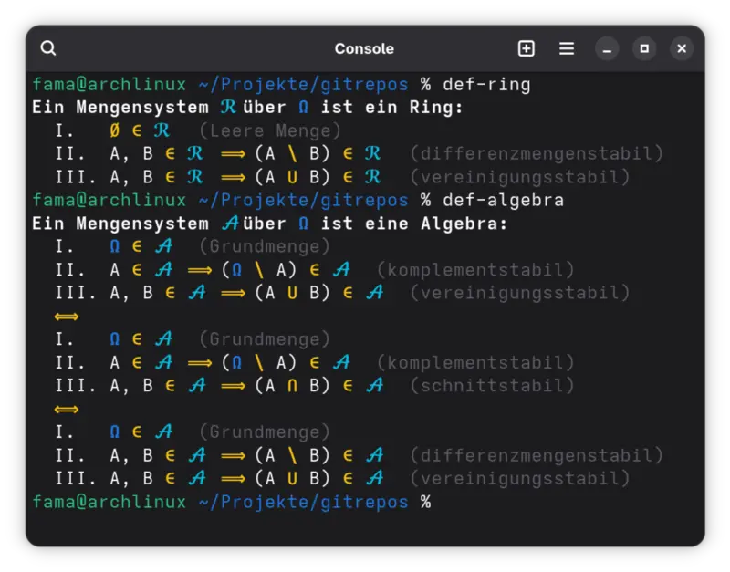

# MathDefs für Zsh

Eine Sammlung von Definitionen als `print` Ausgabe von `zsh` Funktionen für das Terminal. Die Befehle werden über Zsh-Autoloading (Lazy Loading) und bieten - je nach Eintrag im [master.zsh](./master.zsh) und der Colors Datei [.zfunc_colors](./.zfunc_colors) File farbiges Syntax-Highlighting:

<p align="center"\>

</p\>

## Repo

 ```bash
.
├── .gitignore
├── img                 # Ordner für Bild Dateien, die im README.md verwendet werden
│   └── screen01.webp
├── master.zsh          # Die zentrale Datei, in der alle Definitionen geschrieben werden
├── .math_decl          # Das Zsh-Skript, das die Parser-Logik und das Autoloading steuert
├── README.md           # Diese README.md Datei
├── .zfunc_colors       # Farbdefinitionen für die Terminal-Ausgabe
└── .zfunc_symbols      # Symboldefinitionen für die Terminal-Ausgabe
 ```

## Setup

1. **Repository ablegen**

   Repository ablegen (Beispiel): `~/Projekte/gitrepos/bazar/mathdefs`
   Falls ein anderer Pafd verwendet wird diesen unten auch anpassen.

2. **`.zshrc` anpassen**

   > ⚠️ Diese Zeile am Ende der `~/.zshrc` einfügen und den Pfad `~/Projekte/gitrepos/bazar/mathdefs` ggf. anpassen:

    ```bash
   [[ -f ~/Projekte/gitrepos/bazar/mathdefs/.math_decl ]] && source ~/Projekte/gitrepos/bazar/mathdefs/.math_decl
    ```

3. **Konfiguration neu laden**

   Öffne ein neues Terminal oder lade die aktuelle Sitzung neu:

    ```bash
   source ~/.zshrc
    ```

4. **Funktionen, die in `master.zsh` stehen, initialisieren**

   Es liest die `master.zsh` neu ein, generiert die Einzeldateien und macht alle Definitionen in der aktuellen Version, sofort als Befehle (z. B. `def-algebra`) verfügbar:

    ```bash
   update-math-funcs
    ```

## Workflow: Definitionen ändern oder hinzufügen

1. Öffne die `master.zsh` und editiere oder erstelle eine Funktion (Format: `function name() { ... }`).
2. (Optional) Passe Inhalte von `.zfunc_colors` oder `zfunc_symbols` an.
3. Führe im Terminal `update-math-funcs` aus.
4. Fertig! Alte Versionen werden automatisch im Ordner `.backups` gesichert und die neuen Befehle sind sofort einsatzbereit.