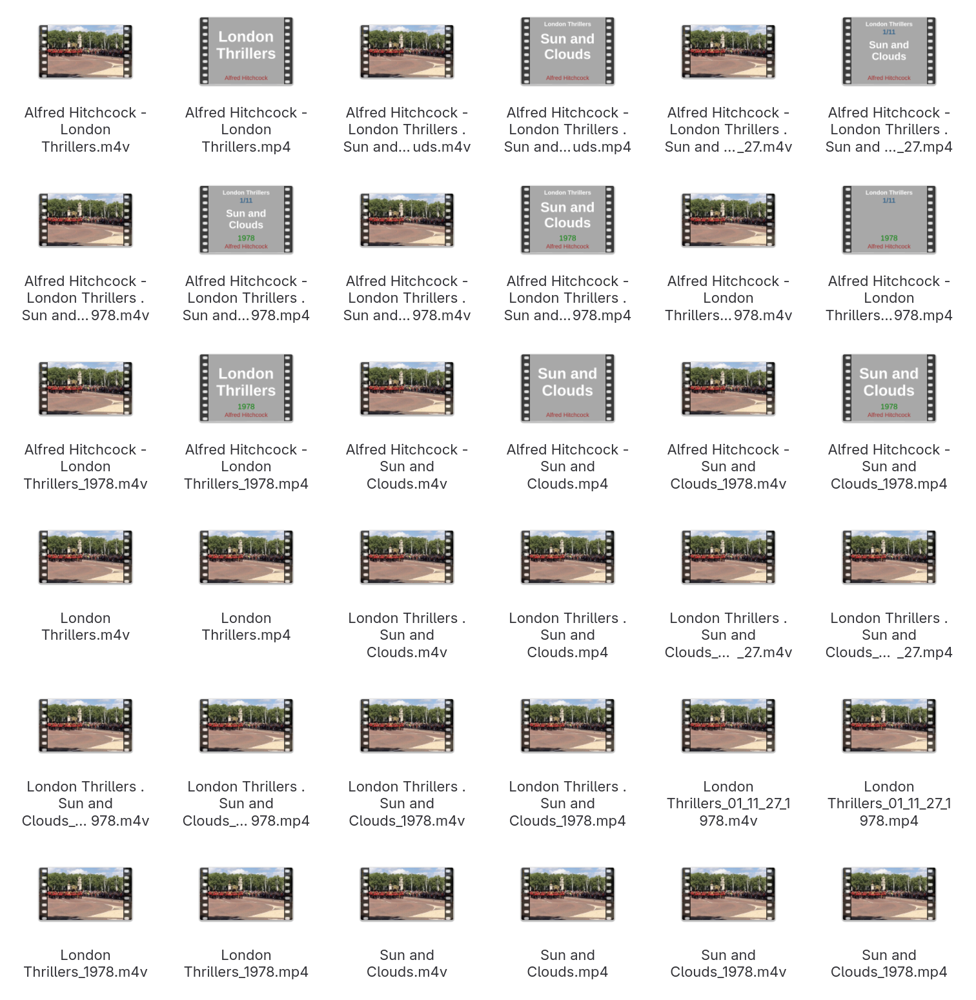

# Skripte für Film Sammlungen

`zsh` Skripte um ein Verzeichnis von `mp4` und `m4v` Film-Sammlungen zu erstellen, Metadaten einzutragen und Cover für die Film-Datei zu erstellen.

Unterstützte Metadaten Tags:

`title`,`artist`,`show`,`season_number`,`episode_sort`,`date`,`description`,`cover`

## 1. Setup

Folgendes wurde verwendet:

* **Plattform:** macOS oder Linux
* **Shell-Umgebung:** `zsh`
* **Reservierte Wörter / Syntax-Konstrukte:** `[[`, `(())`
* **Zsh Builtins (Interne Befehle):** `local`, `setopt`, `unsetopt`, `unset`, `source`, `typeset`, `zmodload`, `zparseopts`, `command`, `print`, `return`
* **Externe Befehle (Standard-Programme):** `cp`, `mkdir`, `rm`, `touch`
* **Tools:** `jq` (Verarbeitung von JSON-Daten), `ffmpeg` / `ffprobe` (Metadaten aus Film-Datei und Video-Remux einer Film-Datei), `atomicparsley` (Schreiben von Metadaten und Cover-Bildern in eine Film-Datei), `imagemagick` (Erstellen von Cover-Bildern)

**Optional: Parallelisierung (Linux/macOS)**

* **Tools:** `parallel` (Parallele Ausführung von Skripten unter macOS oder Linux)

**Optional: KI-Funktion über Gemini API**

* **Tools:** `python3` (Ausführung von `metadata.py`)
* **Access Key:** Google AI Studio Key (Gemini) für API-Zugriff aus `metadata.py`

### Installation

**macOS (Homebrew)**

```bash
brew install jq python ffmpeg atomicparsley imagemagick parallel
```

**Linux (Debian)**

`pyenv` wird unter Debian üblicherweise über den offiziellen Installer bezogen. Für die Python-Funktionalität reicht `python3-full`.

```bash
sudo apt update
sudo apt install jq python3-full ffmpeg atomicparsley imagemagick parallel
```

**Linux (Arch)**

```bash
sudo pacman -Syu jq python ffmpeg atomicparsley imagemagick parallel base-devel
```
## 2. Verzeichnis und Dateien

```text
.
├── cover.zsh
├── inventory.zsh
├── tag.zsh
├── data
│   └── img
├── metadata.py
├── README.md
├── src
│   ├── globals.zsh
│   └── utils.zsh
└── test
    ├── test.m4v
    ├── test.mp4
    ├── gen_mov.zsh
    ├── tests.zsh
    └── tests_parallel.zsh
```

* `cover.zsh`: **Anwenderskript:** generiert und bettet Cover-Bilder in die Film-Dateien ein.
* `inventory.zsh`: **Anwenderskript:** aktualisiert die JSON-Datenbank basierend auf Film-Dateien-Metadaten.
* `tag.zsh`: **Anwenderskript:** Schreibt Metadaten aus Dateinamen in die Film-Dateien.
* `data\`: **Referenzierte Dateien** die in `README.md` verwendet werden.
* `metadata.py`: **Anwenderskript:** ergänzt fehlende Infos in der die JSON-Datenbank via KI.
* `README.md`: **Readme Datei** fürs Git Repo.
* `src/globals.zsh`: eine Sammlung von `zsh`-Funktionen für die anderen Skripte.
* `src/utils.zsh`: Definitionen von globalen Variablen für die anderen Skripte.
* `test/test.m4v`: **Dummy Film-Datei:** für die Tests im `m4v` Format.
* `test/test.mp4`: **Dummy Film-Datei:** für die Tests im `mp4` Format.
* `test/gen_mov.zsh`: **Testerskript:** erstellt Testfälle (also Film-Dateien) und eine leere JSON-Datenbank in `test/movies/` und `test/movies/filme_inventory.json`.
* `test/tests.zsh`: **Testerskript:** Erstellt Testfälle (also Film-Dateien) in `test/movies/` und durchläuft mit diesen als Input die Anwenderskripte. Die Ergebisse stehen in `test/movies/` und `test/movies/filme_inventory.json`.
* `test/tests_parallel.zsh`: **Testerskript:** wie `test/tests.zsh` aber teils parallelisierte Ausführung mit Gnu Parallel.

## 3. Anwenderskripte

### A.) Tags (_Metadaten_) schreiben mit `tag.zsh`

#### Syntax

```text
./tag.zsh -h
```
```text
Verwendung: ./tag.zsh [OPTIONEN]

Optionen:
  -h,  --help           Zeigt diese Hilfe an und beendet das Skript
  -v,  --verbose        Log an
  -fo, --force          Erzwingt das Überschreiben von Metadaten
  -ff, --fforce         Erzwingt Löschen und Überschreiben von Metadaten
  -do, --db-only        Liest Info für Metadaten aus der JSON Datenbank ansonsten werden Infos aus Datenamen verwendet
  -tr, --test-run       Startet den Testmodus mit Test Film-Dateien und verwendet Testverzeichnisse
  -dr, --dry-run        Simuliert den Durchlauf, ohne Dateien zu verändern
  -in, --infile <arg>   Eingabe Film-Datei ansonsten stdin
```

Wenn `--db-only` *nicht* gesetzt ist: 

Es werden die Namen der Film-Dateien anhand definierter Muster (s.u.) untersucht und dann die Tags (Artist, Show, Staffel, Episode, Titel, etc.) als Metadaten in die Film-Datei geschrieben. 

Es kann vorkommen, dass die Film-Datei neu verpackt wird (_Remux_), um Platz für die Metadaten in der neuen "Verpackung" zu schaffen. Es kann auch sein, dass eine `mp4` zu einer `m4v` Film-Datei gewandelt wird, in dem Fall wird die neue Film-Datei in einem neuen Verzeichnis _`YYYYMMDD_HHMMSS`_ am Ort der originalen Film-Datei gespeichert und die alte Datei wird nach `DEPRECATED_<orig filename>.old` umbenannt.

Wenn `--db-only` gesetzt ist: 

Es werden die Daten aus der JSON-Datenbank gelesen und dann die Tags (Artist, Show, Staffel, Episode, Titel, etc.) als Metadaten in die Film-Datei geschrieben.

**Unterstützte Muster für Namen von Film-Dateien:**

```text
Title
Artist - Title
Title_Year
Artist - Title_Year
Artist - Show_S_E_Total_Year
Show_S_E_Total_Year
Artist - Show . Title_S_E_Total_Year
Show . Title_S_E_Total_Year
Artist - Show . Title_S_E_Total
Show . Title_S_E_Total 
Artist - Show . Title_Year
Show . Title_Year
Artist - Show . Title
Show . Title
```

Beispiele:

```text
One More Mile to Go
Alfred Hitchcock - One More Mile to Go
One More Mile to Go_1957
Alfred Hitchcock - One More Mile to Go
Alfred Hitchcock - Black White_01_07_10_1957 
Black White_01_07_10_1957
Alfred Hitchcock - Black White . One More Mile to Go_01_07_10_1957
Black White . One More Mile to Go_01_07_10_1957
Alfred Hitchcock - Black White . One More Mile to Go_01_07_10
Black White . One More Mile to Go_01_07_10
Alfred Hitchcock - Black White . One More Mile to Go_1957
Black White . One More Mile to Go_1957
Alfred Hitchcock - Black White . One More Mile to Go
Black White . One More Mile to Go
```

### B.) Datenbank aktualisieren mit `inventory.zsh`

#### Syntax

```text
./inventory.zsh -h
```
```text
Verwendung: ./inventory.zsh [OPTIONEN]

Optionen:
  -h,  --help           Zeigt diese Hilfe an und beendet das Skript
  -v,  --verbose        Log an
  -fo, --force          Überschreibt Daten, wenn schon Daten zur Film-Datei in der Dtenbank stehen
  -up, --update-paths   Versucht die Film-Datei Pfade zu aktualisieren, wenn sich nur die Endung (mp4 / m4v) geändert hat
  -tr, --test-run       Startet den Testmodus mit Test Film-Dateien und verwendet Testverzeichnisse
  -dr, --dry-run        Simuliert den Durchlauf, ohne Dateien zu verändern
  -in, --infile <arg>   Eingabe Film-Datei ansonsten stdin
```
Liest die Metadaten (per `ffprobe`) aus den Dateien und aktualisiert oder ergänzt die globale JSON-Datenbank (`filme_inventory.json`).

* **Wichtig:** Setzt voraus, dass die Dateien bereits getaggt sind (z.B. durch `tag.zsh`).
* Unterstützt globale Datenbanken: Einträge aus anderen Verzeichnissen bleiben erhalten.

### C.) Cover erstellen und in der Film-Datei speichern mit `cover.zsh`

#### Syntax

```text
./cover.zsh -h 
```
```text
Verwendung: ./cover.zsh [OPTIONEN]

Optionen:
  -h,  --help           Zeigt diese Hilfe an und beendet das Skript
  -v,  --verbose        Log an
  -fo, --force          Erzwingt das Neuladen/Überschreiben vorhandener Cover
  -co, --cover-only     Erstellt Cover aber schreibt sie nicht in die Film-Datei
  -tr, --test-run       Startet den Testmodus mit Test Film-Dateien und verwendet Testverzeichnisse
  -dr, --dry-run        Simuliert den Durchlauf, ohne Dateien zu verändern
  -lo, --layout <arg>   Gibt das zu verwendende layout (FHD | Portrait | Square | Landscape) für Cover an
  -in, --infile <arg>   Eingabe Film-Datei ansonsten stdin
```

Verwendet ***ausschließlich Metadaten aus der Film-Datei*** also _nicht_ aus `filme_inventory.json` und _nicht_ aus dem Bezeichner der Film-Datei und generiert daraus ein Cover-Bild und bettet dieses in die Film-Datei ein.

Es kann dabei vorkommen, dass die Film-Datei neu verpackt wird (_Remux_), um Platz für das Cover in der neuen "Verpackung" zu schaffen. Es kann auch sein, dass eine `mp4` zu einer `m4v` Film-Datei gewandelt wird, in dem Fall wird die neue Film-Datei in einem neuen Verzeichnis _`YYYYMMDD_HHMMSS`_ am Ort der originalen Film-Datei gespeichert und die alte Datei wird nach `DEPRECATED_<orig filename>.old` umbenannt.

## 4. Ein- und Ausgaben der Anwenderskripte

**Ausgabemeldungen in der Konsole:**

Bei allen Anwenderskript kann man mittels `--verbose` die detaillierten Ausgabemeldungen (Logs) anschalten.

**Allgemeines zur Filmdatenbank `filme_inventory.json`:**

* **Funktion:** Zentrale Speicherung von Metadaten zu Filmdateien.
* **Erstellung und Update:** Generierung über `inventory.zsh`.
* **Datenquelle:** Input für `tag.zsh` bei Verwendung von `--db-only`.
* **Datensicherung (Normaler Modus):** Automatische Backup-Erstellung (`filme_inventory_<YYYYMMDD_HHMMSS>.json`) im Ordner `filme_inventory/` vor Änderungen an Dateien.
* **Testmodus (`--test-run`):** Nutzung von einer separaten Test-Datenbank im Ordner `test/movies/` ohne Backup-Erstellung.

**Allgemeine Regeln für Filmdateien:**

* **Eingabe-Priorität:** `--in-file <file>` überschreibt `stdin` (Pipe).
* **Ausgabe (Standard):** Überschreibt Originaldatei am selben Pfad.
* **Ausgabe (bei _Remux_):** Erstellt Unterordner `<YYYYMMDD_HHMMSS>` für neue Datei, benennt Originaldatei um in `DEPRECATED_<dateiname>.old`.
* **Sicherheit:** `--dry-run` blockiert jeglichen Output (keine Änderungen an Dateien oder Verzeichnissen).

#### Übersicht nach Skript

| Skript | Input | Output |
| --- | --- | --- |
| **`cover.zsh`** | Filmdatei(en) | Filmdatei(en) |
| **`tag.zsh`** | Filmdatei(en)<br>*(bei `--db-only`: zusätzlich `filme_inventory.json`)* | Filmdatei(en) |
| **`inventory.zsh`** | Filmdatei(en) | `filme_inventory.json` |

#### Pfad-Logik (abhängig von `--test-run`)

*Referenz: `<base>` entspricht dem Verzeichnis `<path to movietags>/movietags` nach einem `git clone`.*

| Pfad-Ziel | Normaler Modus | `--test-run` Modus |
| --- | --- | --- |
| **Film-Input (`tag.zsh`, `cover.zsh`)** | `--in-file` oder `stdin` | Fest: `<base>/test/movies`<br>*(ignoriert `--in-file` und `stdin`)* |
| **Film-Input (`inventory.zsh`)** | `--in-file` oder `stdin` | Standard: `<base>/test/movies`<br>*(akzeptiert aber `--in-file` und `stdin`)* |
| **`filme_inventory.json` Pfad** | `<base>/filme_inventory.json` | `<base>/test/movies/ filme_inventory.json` |
| **`filme_inventory.json` Backup** | Backup nach `<base>/filme_inventory/ filme_inventory_<YYYYMMDD_HHMMSS>.json` | Kein Backup |

## 5. Testerskripte

### `./test/tests.zsh`, `./test/tests_parallel.zsh` und `./test/gen_mov.zsh`

#### Programmlogik testen

Zum Testen der Programmlogik gibt es ein Testerskript unter `./test/tests.zsh` (`./test/tests_parallel.zsh` führt dasselbe parallelisiert aus).

`tests.zsh` (bzw. `tests_parallel.zsh`) erstellt Testfälle (also Film-Dateien) unter `test/movies/` und durchläuft damit als Input die Anwenderskripte. Das Ergebniss sind die um Metadaten und Cover erweiterten Film-Dateien unter `test/movies/` und eine Datei `test/movies/filme_inventory.json` als Inventarliste der Film-Dateien.

Das Skript wird im normalen Workflow nicht verwendet, es kann aber dazu verwendet werden:

  * sich mit der Arbeitsweise vertraut zu machen
  * die generierten Film-Dateien auf Ziel-Anwendung hinsichtlich Layout und Ansicht prüfen
  * verschiedene Cover Layouts erstellen, indem man in `./test/tests.zsh` die Layouts auskommentiert

Beispiel Aufrufe mit Zeitmessung:

Aufrufe in `<path to movietags>/movietags`:

```text
time ./test/tests.zsh
```

```text
🟤 File: <path to movietags>/movietags/test/movies/London Sights_01_11_27_2002.m4v
🟤 File: <path to movietags>/movietags/test/movies/London Sights_01_11_27_2002.mp4
...
🟤 File: <path to movietags>/movietags/test/movies/Unkown Artist - Sunshine and Clouds.m4v
🟤 File: <path to movietags>/movietags/test/movies/Unkown Artist - Sunshine and Clouds.mp4
🟣 File: <path to movietags>/movietags/test/movies/London Sights_01_11_27_2002.m4v
🟣 File: <path to movietags>/movietags/test/movies/London Sights_01_11_27_2002.mp4
...
🟣 File: <path to movietags>/movietags/test/movies/Unkown Artist - Sunshine and Clouds.m4v
🟣 File: <path to movietags>/movietags/test/movies/Unkown Artist - Sunshine and Clouds.mp4
./test/tests.zsh  20,00s user 4,36s system 99% cpu 24,438 total
```

```text
time ./test/tests_parallel.zsh
```

```text
🟤 File: <path to movietags>/movietags/test/movies/London Sights_01_11_27_2002.mp4
🟣 File: <path to movietags>/movietags/test/movies/London Sights_01_11_27_2002.mp4
🟤 File: <path to movietags>/movietags/test/movies/London Sights_01_11_27_2002.m4v
🟣 File: <path to movietags>/movietags/test/movies/London Sights_01_11_27_2002.m4v
...
🟤 File: <path to movietags>/movietags/test/movies/London Sights . Sunshine and Clouds.mp4
🟣 File: <path to movietags>/movietags/test/movies/London Sights . Sunshine and Clouds.mp4
./test/tests_parallel.zsh  33,49s user 8,60s system 1265% cpu 3,326 total
```

#### Test-Film-Dateien erstellen

`gen_mov.zsh` erstellt nur die Test-Film-Dateien und eine leere `filme_inventory.json` unter `test/movies/` ohne die Anwenderskripte aufzurufen.

Die erstellten Dateien kann man als "Dummy" Film-Dateien für den Aufruf der Anwenderskripte verwenden:

```text
print -l -- test/movies/**/*.(mp4|m4v) | ./tag.zsh --dry-run > /dev/null 
```

(movietags) fama@archlinux ~/Projekte/gitrepos/tools-scripts-recipes/movietags % print -l -- test/movies/**/*.(mp4|m4v) | ./inventory.zsh --test-run --dry-run --verbose > /dev/null                                             lokal
Prüfe Abhängigkeiten...
Alle Abhängigkeiten gefunden.
Lade Inventar: <path to movietags>/movietags/test/movies/filme_inventory.json
Inventar Datei: <path to movietags>/movietags/test/movies/filme_inventory.json
Pfad: <path to movietags>/movietags
Zeitstempel: 20260222_062106


> **⚠️** Alle Aufrufe von `inventory.zsh` ohne `--test-run` Flag, ändern unter Umständen die `filme_inventory.json` unter  werden im `movietags`-Verzeichnis (z.B. `~/Projekte/gitrepos/tools-scripts-recipes/movietags`) gemacht.

Hier ohne `--test-run`:

```text
print -l -- test/movies/**/*.(mp4|m4v) | ./inventory.zsh  --dry-run --verbose > /dev/null 
```

```test
Prüfe Abhängigkeiten...
Alle Abhängigkeiten gefunden.
Lade Inventar: <path to movietags>/movietags/filme_inventory.json
Inventar Datei: <path to movietags>/movietags/filme_inventory.json
Pfad: <path to movietags>/movietags
Zeitstempel: 20260222_062627
File Source by Stdin
⚪ File: test/movies/20260222_061004/London Sights . Sunshine and Clouds_2002.m4v
Unkown: London Sights . Sunshine and Clouds_2002.m4v
[NEU] London Sights . Sunshine and Clouds_2002.m4v
    -> Title: Sunshine and Clouds | Artist: 
...
⚪ File: test/movies/Unkown Artist - Sunshine and Clouds.mp4
Unkown: Unkown Artist - Sunshine and Clouds.mp4
[NEU] Unkown Artist - Sunshine and Clouds.mp4
    -> Title: Sunshine and Clouds | Artist: Unkown Artist
DRY RUN BEENDET. Keine Änderungen gespeichert.
Fertig.
```

Hier mit `--test-run`:

```text
print -l -- test/movies/**/*.(mp4|m4v) | ./inventory.zsh --test-run --dry-run --verbose > /dev/null 
```

```test
Prüfe Abhängigkeiten...
Alle Abhängigkeiten gefunden.
Lade Inventar: <path to movietags>/movietags/test/movies/filme_inventory.json
Inventar Datei: <path to movietags>/movietags/test/movies/filme_inventory.json
Pfad: <path to movietags>/movietags
Zeitstempel: 20260222_062106
File Source by Stdin (Test Mode)
⚪ File: <path to movietags>/movietags/test/movies/London Sights_01_11_27_2002.m4v
Unkown: London Sights_01_11_27_2002.m4v
[NEU] London Sights_01_11_27_2002.m4v
    -> Title:  | Artist: 
...
⚪ File: <path to movietags>/movietags/test/movies/Unkown Artist - Sunshine and Clouds.mp4
Unkown: Unkown Artist - Sunshine and Clouds.mp4
[NEU] Unkown Artist - Sunshine and Clouds.mp4
    -> Title: Sunshine and Clouds | Artist: Unkown Artist
DRY RUN BEENDET. Keine Änderungen gespeichert.
Fertig.
```

## 6. Workflow

Die drei Anwenderskripte `tag.zsh`, `cover.zsh` und `inventory.zsh` kann man je nach Anwendungsfall unterschiedlich kombinieren und verwenden.

Viele Skript Aufrufe können unter Linux auch parallelisiert ausgeführt werden, was die Ausführungsdauer - auf Kosten der Systemlast - je nach Anzahl der CPUs verringert. Soweit möglich, wird unten immer der normale und der mit "GNU Parallel" parallelisierte Aufruf angegeben.

Beispiel Anwendungsfälle mit Workflows:

A.) Film-Bestand (Beispiel-Wurzelpfad hier: `/mnt/DatenArchiv/Filme/`) ohne Inventarisierung, Metadaten und Cover-Bilder

1. Kurzer Bestandscheck (***Dry-Run***): 

    Normaler Aufruf:
    ```text
    print -l -- /mnt/DatenArchiv/Filme/**/*.(mp4|m4v) | ./tag.zsh --dry-run > /dev/null 
    ```

    Aufruf mit paralleler Ausführung (***Dry-Run***): 
    ```text
    print -l -- /mnt/DatenArchiv/Filme/**/*.(mp4|m4v) | parallel -j 16 './tag.zsh --dry-run -in {}' > /dev/null 
    ```

2. Schreiben von Metadaten (***Hot-Run***):

    Generierung von Metadaten aus Dateinamen und Speicherung in Film-Dateien als Standard-Tags:

    Normaler Aufruf:
    ```text
    print -l -- /mnt/DatenArchiv/Filme/**/*.(mp4|m4v) | ./tag.zsh > /dev/null 
    ```

    Aufruf mit paralleler Ausführung:
    ```text
    print -l -- /mnt/DatenArchiv/Filme/**/*.(mp4|m4v) | parallel -j 16 './tag.zsh -in {}' > /dev/null 
    ```

3. Erzeugen oder Erweitern einer Inventar-Datenbank (***Hot-Run***):

    Aufruf:
    ```text
    print -l -- /mnt/DatenArchiv/Filme/**/*.(mp4|m4v) | ./inventory.zsh > /dev/null 
    ```

    Kein parallelisierter Aufruf, da Bearbeitung einer zentralen Datei (JSON-Textdatei).

4. Erzeugen und Speichern von Cover-Bildern (***Hot-Run***):

    Auslesen von Metadaten aus Film-Dateien, Erzeugung von Cover-Bildern und Speicherung in Film-Dateien:

    Normaler Aufruf:
    ```text
    print -l -- /mnt/DatenArchiv/Filme/**/*.(mp4|m4v) | ./cover.zsh > /dev/null 
    ```

    Aufruf mit paralleler Ausführung:
    ```text
    print -l -- /mnt/DatenArchiv/Filme/**/*.(mp4|m4v) | parallel -j 16 './cover.zsh -in {}' > /dev/null 
    ```

B.) Film-Bestand (Beispiel-Wurzelpfad hier: `/mnt/DatenArchiv/Filme/`) mit bestehender Inventarisierung und neuen Dateien

Bei Kenntnis von Dateieigenschaften Einschränkung der Dateiauswahl durch `zsh` Globbing (vorher `setopt EXTENDED_GLOB` ausführen). 

Zusammenfassung von Verarbeitungsschritten in einer Pipe. Ausführung normal oder parallelisiert:

1. Verarbeitung aller Dateien (vorhandene Cover-Bilder und Metadaten in Film-Dateien werden nicht überschrieben):

    Normaler Aufruf:
    ```text
    print -l -- /mnt/DatenArchiv/Filme/**/*.(mp4|m4v) | ./tag.zsh | ./cover.zsh > /dev/null
    ```

    Aufruf mit paralleler Ausführung:
    ```text
    print -l -- /mnt/DatenArchiv/Filme/**/*.(mp4|m4v) | parallel -j 16 './tag.zsh -in {} | ./cover.zsh' > /dev/null
    ```

2. Verarbeitung von Filmen mit einem bestimmten Begriff im Namen (z.B. "Polizeiruf 110"):

    Filterung durch einfache `zsh` Wildcards.

    Normaler Aufruf:
    ```text
    print -l -- /mnt/DatenArchiv/Filme/**/*Polizeiruf\ 110*.(mp4|m4v) | ./tag.zsh | ./cover.zsh > /dev/null
    ```

    Aufruf mit paralleler Ausführung:
    ```text
    print -l -- /mnt/DatenArchiv/Filme/**/*Polizeiruf\ 110*.(mp4|m4v) | parallel -j 16 './tag.zsh -in {} | ./cover.zsh' > /dev/null
    ```

3. Verarbeitung von kürzlich hinzugefügten Dateien (z.B. geändert in den letzten 7 Tagen):

    Filterung durch `zsh` Time Qualifier `(m-7)`.

    Normaler Aufruf:
    ```text
    print -l -- /mnt/DatenArchiv/Filme/**/*.(mp4|m4v)(m-7) | ./tag.zsh | ./cover.zsh > /dev/null
    ```

    Aufruf mit paralleler Ausführung:
    ```text
    print -l -- /mnt/DatenArchiv/Filme/**/*.(mp4|m4v)(m-7) | parallel -j 16 './tag.zsh -in {} | ./cover.zsh' > /dev/null
    ```

4. Verarbeitung von großen Dateien (z.B. über 1 GB):

    Filterung durch ZSH File-Size Qualifier `(L+1000m)`. Praktisch zum Ausschluss kleiner Teaser oder Trailer-Dateien.

    Normaler Aufruf:
    ```text
    print -l -- /mnt/DatenArchiv/Filme/**/*.(mp4|m4v)(L+1000m) | ./tag.zsh | ./cover.zsh > /dev/null
    ```

    Aufruf mit paralleler Ausführung:
    ```text
    print -l -- /mnt/DatenArchiv/Filme/**/*.(mp4|m4v)(L+1000m) | parallel -j 16 './tag.zsh -in {} | ./cover.zsh' > /dev/null
    ```

C.) Film-Bestand (Beispiel-Wurzelpfad hier: `/mnt/DatenArchiv/Filme/`) mit bestehender Inventarisierung und Änderungen in der JSON-Inventar-Datenbank `filme_inventory.json`

Auch hier ist die Verwendung von ZSH-Filteroptionen oder die Angabe von einzelnen Dateipfaden möglich. Zur Festlegung von der Datenbank als Metadaten-Quelle (anstelle von Dateinamen) wird die Option `--db-only` in Kombination mit `-force` oder `--fforce` verwendet:

1. Ergänzung von neuen Metadaten (z.B. Erscheinungsdatum) aus der Datenbank in die Film-Datei und Neu-Erstellung von Cover-Bildern durch die Option `-force`:

    Normaler Aufruf:
    ```text
    print -l -- /mnt/DatenArchiv/Filme/**/*Hitchcock*.(mp4|m4v)(L+800m) | ./tag.zsh --db-only -force | ./cover.zsh > /dev/null
    ```

    Aufruf mit paralleler Ausführung:
    ```text
    print -l -- /mnt/DatenArchiv/Filme/**/*Hitchcock*.(mp4|m4v)(L+800m) | parallel -j 16 './tag.zsh --db-only -force -in {} | ./cover.zsh' > /dev/null
    ```

2. Überschreiben von bestehenden Metadaten (z.B. nach Korrektur von Schreibfehlern) in der Film-Datei und Neu-Erstellung von Cover-Bildern durch die Option `--fforce`:

    Normaler Aufruf:
    ```text
    print -l -- /mnt/DatenArchiv/Filme/**/*Polizeiruf\ 110*.(mp4|m4v)(L+800m) | ./tag.zsh --db-only --fforce | ./cover.zsh > /dev/null
    ```

    Aufruf mit paralleler Ausführung:
    ```text
    print -l -- /mnt/DatenArchiv/Filme/**/*Polizeiruf\ 110*.(mp4|m4v)(L+800m) | parallel -j 16 './tag.zsh --db-only --fforce -in {} | ./cover.zsh' > /dev/null
    ```

## 7. Testen

Es können ein paar Test-Film-Dateien mit `./test/gen_mov.zsh` erstellt werden.

Alle Änderungen werden im Unterverzeichnis `./test/` gemacht.

> **⚠️** Die Aufrufe werden im `movietags`-Verzeichnis (z.B. `~/Projekte/gitrepos/tools-scripts-recipes/movietags`) gemacht.

```text
./test/gen_mov.zsh
```

Erzeugt 36 kleinen Film-Dateien im Verzeichnis `./test/movies/`.

> **⚠️**  Für folgende Aufrufe sollte in der Z-Shell `EXTENDED_GLOB` mit `setopt EXTENDED_GLOB` eingeschaltet werden.

> **⚠️** Detaillierte Ausgaben kann man über `--verbose` einschalten ansonsten wird nur eine Fortschrittsanzeige mit der bearbeiteten Film-Datei mit Markierungen ausgegeben: `tag.zsh`: "🟤", `cover.zsh`: "🟣", `inventory.zsh`: "⚪".

Beispiele für Aufrufe:

1. Parsen der Basis-Tags Infos aus Dateinamen mit `tag.zsh` und erstellen und speichern von Cover-Bildern:

    Normaler Aufruf:

    ```text
    time print -l -- test/movies/* | ./tag.zsh --force | ./cover.zsh --force > /dev/null
    ```

    ```text
    🟤 File: test/movies/London Sights_01_11_27_2002.m4v
    🟤 File: test/movies/London Sights_01_11_27_2002.mp4
    🟣 File: test/movies/London Sights_01_11_27_2002.m4v
    ...
    🟤 File: test/movies/Unkown Artist - Sunshine and Clouds.m4v
    🟣 File: test/movies/Unkown Artist - Sunshine and Clouds.m4v
    print -l -- test/movies/*  0,00s user 0,00s system 80% cpu 0,001 total
    ./tag.zsh --force  15,17s user 2,63s system 99% cpu 17,844 total
    ./cover.zsh --force > /dev/null  11,09s user 2,13s system 72% cpu 18,187 total
    ```

    Aufruf mit paralleler Ausführung:

    ```text
    time print -l -- test/movies/* | parallel -j 16 './tag.zsh --force -in {} | ./cover.zsh --force' > /dev/null
    ```
    ```text
    🟤 File: test/movies/London Sights . Sunshine and Clouds_01_11_27 (2).m4v
    🟣 File: test/movies/London Sights . Sunshine and Clouds_01_11_27 (2).m4v
    🟤 File: test/movies/London Sights_01_11_27_2002.mp4
    ...
    🟤 File: test/movies/Unkown Artist - Sunshine and Clouds.m4v
    🟣 File: test/movies/Unkown Artist - Sunshine and Clouds.m4v
    print -l -- test/movies/*  0,00s user 0,00s system 71% cpu 0,001 total
    parallel -j 16 './tag.zsh --force -in {} | ./cover.zsh --force' > /dev/null  29,66s user 8,07s system 1262% cpu 2,989 total

    ```

2. Aufnahme von Meta-Infos aus Film-Dateien in eine JSON-Datenbank mit `inventory.zsh`:

    Normaler Aufruf (keine Parallelisierung möglich):

    ```text
    print -l -- test/movies/* | ./inventory.zsh --test-run > /dev/null
    ```

3. Nur Cover-Bilder im Layout `Square` erzeugen (nicht in die Film-Dateien schreiben):
    
    Ablage von erzeugten Covern in einem eindeutigen Verzeichnis unter `./cover/YYYYMMDD_HHMMSS`.

    Normaler Aufruf:

    ```text
    print -l -- test/movies/*(#i)artis*.mp4 | ./cover.zsh --cover-only --layout Square
    ```

    Aufruf mit paralleler Ausführung:

    ```text
    print -l -- test/movies/*(#i)artis*.mp4 | parallel -j 16 './cover.zsh --cover-only --layout Square -in {}' > /dev/null
    ```

    Hier die neun Cover-Bilder:


    <table align="center" width="600px">
    <tr>
    <td align="center">
    
    </td>
    <td align="center">
    
    </td>
    <td align="center">
    
    </td>
    </tr>
    <tr>
    <td align="center">
    
    </td>
    <td align="center">
    
    </td>
    <td align="center">
    
    </td>
    </tr>
    <tr>
    <td align="center">
    
    </td>
    <td align="center">
    
    </td>
    <td align="center">
    
    </td>
    </tr>
    </table>

4. Neue Cover-Bilder erzuegen und im Default-Layout (`Landscape`) den Film-Dateien hinzufügen:

    ```text
    print -l -- test/movies/*(#i)artis*.mp4 | ./cover.zsh
    ```

    Screenshot `nautilus` unter Linux Gnome mit den neun verarbeiteten Film-Dateien:

    <table align="center"width=" 600px">
    <tr>
    <td align="center">
    
    </td>
    </tr>
    </table>

    Screenshot `Gallery (Galerie)` App auf einem Samsung-Tablet mit 9 Film-Dateien, die `Square` Layout Cover Bilder beinhalten (die anderen Film-Dateien haben keine Cover):

    <table align="center" width="600px">
    <tr>
    <td align="center">
    
    </td>
    </tr>
    </table>

## 8. KI-Anreicherung (`metadata.py`)

Analysiert Einträge in der JSON-Datei (`filme_inventory.json`), die unvollständig sind (z.B. fehlendes Jahr oder Originaltitel). Fragt fehlende Informationen (Jahr, Originaltitel, Regisseur, Hauptdarsteller) bei der Google Gemini API ab und ergänzt diese in der lokalen Datenbank.

#### Python-Umgebung (Empfohlen: pyenv)

Virtuelle Umgebung via `pyenv` einrichten und Sachen installieren:

```text
pyenv install 3.12.1
pyenv virtualenv 3.12.1 movietags-env
pyenv local movietags-env
pip install google-generativeai
```

#### Verwendung

1. API-Key setzen:

```text
export GEMINI_API_KEY="GOOGLE_AI_KEY"
```

2. ***Dry-Run***: Zeigt geplante Änderungen ohne API-Aufruf.

```text
print -l -- /mnt/DatenArchiv/Filme/*Hitchcock* | python metadata.py --dry-run
```

3. ***Hot-Run***:

```text
print -l -- /mnt/DatenArchiv/Filme/*Hitchcock* | python metadata.py
```

*Option:* `--limit-batches 1` (Begrenzt auf den ersten Stapel zu 10 Filmen).

#### Ergebnis-Beispiel

Das Skript ergänzt fehlende Metadaten wie `jahr`, `titel.orig` und `darsteller`.

**Vorher (Ausgangsdaten aus `inventory.zsh`):**

```json
[
  {
    "nr": 1,
    "datei": ".../Alfred Hitchcock - Über den Dächern von Nizza.mp4",
    "artist": "Alfred Hitchcock",
    "titel": { "de": "Über den Dächern von Nizza", "orig": "" },
    "jahr": "",
    "darsteller": [ { "rolle": "", "actor": "" } ]
  }
]
```

**Nachher (Ergänzt durch `metadata.py`):**

```json
[
  {
    "nr": 1,
    "datei": ".../Alfred Hitchcock - Über den Dächern von Nizza.mp4",
    "artist": "Alfred Hitchcock",
    "titel": { "de": "Über den Dächern von Nizza", "orig": "To Catch a Thief" },
    "jahr": "1955",
    "darsteller": [
      { "rolle": "John Robie", "actor": "Cary Grant" },
      { "rolle": "Frances Stevens", "actor": "Grace Kelly" }
    ]
  }
]
```

## 9. Wichtige Vorarbeiten und Tools für UTF-Normalisierung

Die folgenden Tools und Commands funktionieren mit `uconv` unter Linux.

### UTF-Normalisierung (macOS vs. Linux)

#### macOS nach  Linux (NFC-Format)

> **⚠️**  Nur ausführen, wenn die Dateien und Daten danach nicht mehr unter macOS verwendet werden, sondern fürs Kopieren oder Verwenden auf Linux vorbereitet werden sollen. 

NFC = Normalization Form Canonical Composition

**JSON-Dateien konvertieren:**

Bei der Verwendung von einer JSON-Datei, die unter macOS erstellt wurde und unter Linux weiterverwendet wird, muss man in das richtige UTF-Format unter Linux konvertieren, sonst funktionieren die Vergleichsfunktionen in den Skripten nicht:

**JSON-Dateien konvertieren:**

```text
uconv -x any-nfc filme_inventory.json -o temp.json && mv temp.json filme_inventory.json
```

**Dateinamen konvertieren (zmv):**

Das gilt auch für die Dateinamen, die unter macOS erstellt und von dort kopiert wurden.

Rekursiv durch alle Pfade:

***Hot-Run*** ohne `-n`

```text
autoload -Uz zmv
cd '<filmarchiv wurzelverzeichnis>/Filme/'
zmv -nv '(**/)(*[! -~]*)' '$1$(uconv -x any-nfc <<< "$2")'
```

#### Linux nach macOS (NFD-Format)

> **⚠️**  Nur ausführen, wenn die Dateien und Daten danach nicht mehr unter Linux verwendet werden, sondern fürs Kopieren oder Verwenden auf macOS vorbereitet werden sollen. 

NFD = Normalization Form Canonical Decomposition

Bei der Verwendung von einer JSON-Datei, die unter Linux erstellt wurde und unter macOS weiterverwendet wird, muss man in das macOS UTF-Format konvertieren, sonst funktionieren die Vergleichsfunktionen in den Skripten nicht:

**JSON-Dateien konvertieren:**

```text
uconv -x any-nfd filme_inventory.json -o temp.json && mv temp.json filme_inventory.json
```

**Dateinamen konvertieren (zmv):**

Das gilt auch für die Dateinamen, die unter Linux erstellt und von dort nach macOS kopiert wurden.

Rekursiv durch alle Pfade:

***Hot-Run*** ohne `-n`

```text
autoload -Uz zmv
cd '<filmarchiv wurzelverzeichnis>/Filme/'
zmv -nv '(**/)(*[! -~]*)' '$1$(uconv -x any-nfd <<< "$2")'
```

## 10. Links

[Stackexchange Artikel zum Thema Unicode Normalization Forms](https://unix.stackexchange.com/questions/90100/convert-between-unicode-normalization-forms-on-the-unix-command-line)

[Referenz zsh Expansion inkl. Glob Operators](https://zsh.sourceforge.io/Doc/Release/Expansion.html)