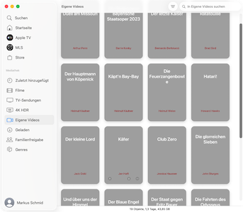
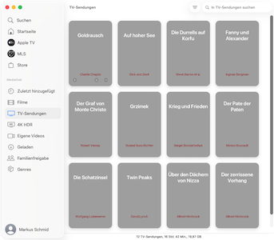

# Movie Files Inventarisierung und Metadata Tool

Inventariesierung und Metadaten-Anreicherung für lokale Videosammlungen. Nutzung der Google Gemini API zur Identifizierung von Filmtiteln und Regisseuren basierend auf Dateinamen.

## Voraussetzungen

  * **Betriebssystem:** macOS oder Linux
  * **Shell:** Zsh (Z Shell)
  * **Tools:**
      * `jq` (JSON-Verarbeitung)
      * `python3` (ab Version 3.9 empfohlen)
  * **API-Zugriff:** Google AI Studio Key (Gemini)

## Installation

Installation der System-Abhängigkeiten:

**macOS (Homebrew):**

```bash
brew install jq python
```

**Linux (Debian/Ubuntu/Arch):**

```bash
sudo apt install jq python3
# oder
sudo pacman -S jq python
```

Installation der Python-Bibliothek:

```bash
pip install google-generativeai
```

## Verwendung

### 1\. Bestandsaufnahme erstellen

Das Skript `inventory.zsh` durchsucht angegebene Verzeichnisse rekursiv nach Videodateien und erstellt eine JSON-Datenbank.

  * **Konfiguration:** Anpassung der Variable `BASE_PFAD` im Skript `inventory.zsh` notwendig.
  * **Ausführung:**
    ```zsh
    ./inventory.zsh
    ```
  * **Ergebnis:** Erstellung oder Aktualisierung von `filme_inventory.json`. Bereits vorhandene Einträge bleiben erhalten.

### 2\. Metadaten anreichern

Das Skript `enrich_metadata.py` analysiert Einträge ohne Titel in der JSON-Datei und fragt fehlende Informationen (Titel DE/Orig, Regisseur) bei der Google Gemini API ab.

  * **API-Key setzen:**
    ```zsh
    export GEMINI_API_KEY="HIER_DEIN_KEY"
    ```
  * **Ausführung (Testlauf):**
    Zeigt geplante Änderungen ohne API-Aufruf an.
    ```zsh
    python enrich_metadata.py --dry-run
    ```
  * **Ausführung (Live):**
    ```zsh
    python enrich_metadata.py
    ```
  * **Optionen:**
      * `--limit-batches N`: Begrenzung auf N Stapel (Chunks) zu je 10 Filmen (z.B. zum Testen).

  ## Andere Skripten

  ### `cover.zsh`

  Das Skript erstellt und schreibt Cover. 
  
  Das Cover und die Ansichten in der TV App (macOS 26 und iPadOS 26):

<table align="center">
  <tr>
    <td align="center">
      
    </td>
    <td align="center">
      
    </td>
  </tr>
  <tr>
    <td align="center">
      
    </td>
    <td align="center">
      
    </td>
  </tr>
</table>

  ### `tag.zsh`

  Das Skript liest Tag Wert aus dem Filename und schreibt sie ins File. 

## Dateistruktur

  * `data/`: Beispiele Inventar-Dateien (`filme_inventory.json` und `done_filme_inventory.json` ausgefüllt).
  * `inventory.zsh`: Zsh-Skript zum Scannen der Festplatte.
  * `metadata.py`: Python-Skript zur KI-gestützten Datenvervollständigung.
  * `cover.zsh`: Weiteres Zsh-Skript zum Erstellen und Schreiben einheitlicher Cover ("macOS 26 und TV App konform").
  * `tag.zsh`: Weiteres Zsh-Skript zum Erstellen und Schreiben der Tags aus dem Filenamen ("macOS 26 und TV App konform").